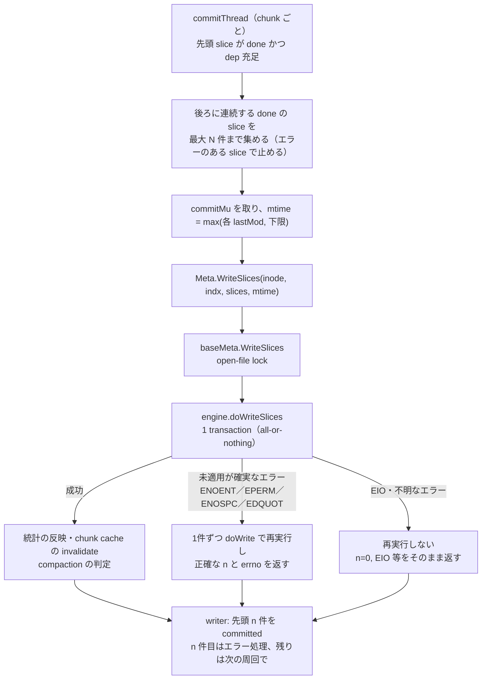

# 同 chunk の slice commit をまとめる（`--meta-write-batch`、Phase 2）設計

- 日付: 2026-10-07
- 状態: 設計（ユーザーのレビュー待ち）
- 親計画: [metadata path 最適化の調査結果と実装計画](2026-10-07-metadata-random-io-optimization-plan.md) の C3。Phase 1 の結果を受けて、方式を変更した（§2）。
- 対象: 本体 `tongsama/juicefs`。ブランチ `feat/range-flush`（18e641b8）の上に作る。

## 1. 目的と前提

**目的**: commit 1件ごとの metadata transaction（Redis で約41ms、4 RTT）を、同じ chunk の連続した slice について1回にまとめる。これにより、inode 単位で直列になっている commit の待ちを減らす。

効く場面:
- Read・Fallocate の前の flush（range／file のどちらでも）
- fsync・close の全体 flush
- QEMU を cache=writeback で使うときの fdatasync

**守ること**:
- 同じ chunk の中の作成順。growing slice の dep（前の chunk の slice の commit を待つ）。
- fsync・read-after-write の保証。
- commit が失敗した slice には正確な errno を返し、実際の保存失敗を隠さない。
- metadata の形式（dump／load・fsck・gc に影響を出さない）。
- 3 engine（Redis・SQL・TKV）で同じ意味になること。

**既定**: `--meta-write-batch=0`（無効）。無効なら、従来とまったく同じ経路を通る。

## 2. 方式の選択（ユーザーと合意済み）

- Phase 1 で、mtime を巻き戻さないための `commitMu`（writer の inode ごとの mutex）を入れた。これが commit を VFS 側で1本の列にしているので、計画書 C3 の「meta 層で同時に届いた要求を leader がまとめる」方式（2a）は機能しない。
- range 版の計測ログ（`vm-io-20261007-172643.log`、inode 614589）の推定:
  - commit 35,010件のうち、前の commit の完了から2ms以内に次が始まる「連続」の列は 13,337個（平均2.6件）。
  - 列の中で同じ chunk の2件目以降が 18,285件あり、まとめられる余地の**約84%が同じ chunk の連続**だった。
  - 1列を1 transaction にした理想では transaction 数は −62%。実際は −40〜60% と見込む。
- そこで、**案C: chunk ごとの commitThread が、同じ chunk の連続した slice をまとめて1回で commit する**方式を採る。chunk をまたぐまとめ（案A）は、計測の結果を見て後で判断する。
- 3 engine すべてに、1回の transaction で書く実装を入れる（ユーザーの選択(c)）。

## 3. 全体の構成



## 4. meta 層

### 4.1 API

```go
// SliceWrite is one slice to append to a chunk, at offset Off within the chunk.
type SliceWrite struct {
	Off   uint32
	Slice Slice
}

// Meta に追加する。既存の Write は残す。
// WriteSlices appends slices to chunk indx of inode in order. The first n
// slices are committed; if n < len(slices), slices[n] failed with st and the
// rest were not attempted.
WriteSlices(ctx Context, inode Ino, indx uint32, slices []SliceWrite, mtime time.Time) (n int, st syscall.Errno)
```

engine interface（`base.go` の `engine`）に追加する:

```go
// doWriteSlices appends all slices in one transaction, all or nothing.
doWriteSlices(ctx Context, inode Ino, indx uint32, slices []SliceWrite, mtime time.Time,
	numSlices *int, delta *dirStat, attr *Attr) syscall.Errno
```

- `numSlices` は、書き込み後のその chunk の slice 数。
- テスト用の engine ラッパー（`delete_queue_test.go` の observer など）にも委譲を追加する。

### 4.2 `baseMeta.WriteSlices`

1. `len(slices) == 1` なら、従来の `Write` を呼んで n を返す（n は 0 か 1）。
2. open-file lock を取る（`Write` と同じ）。defer で `InvalidateChunk(inode, indx)` を呼ぶ。
3. `doWriteSlices` を1回呼ぶ。
4. 成功したら:
   - `updateParentStat`・`updateUserGroupStat` に合計の delta を反映する。
   - compaction を判定する。書き込み前の slice 数を `p = numSlices − k` とし、区間 `(p, numSlices]` に `x%100 == 99` を満たす x があるか、`numSlices > 350` なら判定に進む。その先（2,500件未満なら背景の compaction を要求、以上なら同期 compaction）は従来どおり。
   - n = k を返す。
5. 失敗したら、エラーの種類で分ける:
   - **ENOENT・EPERM・ENOSPC・EDQUOT**（transaction の中で判定するので、未適用が確実）: lock を保持したまま、slice を1件ずつ従来の書き込み処理で commit する。最初に失敗した位置 n とその errno を返す。成功した分の統計反映と compaction の判定は、1件ずつの処理で行う。
   - **それ以外**（EIO・ネットワークエラーなど、EXEC が適用されたかどうか分からない）: 再実行しない。n = 0 と、そのエラーを返す。再実行すると、適用済みだった場合に slice が二重に登録されるから。
6. 1件ずつの処理は、`Write` の本体（lock を取った後の部分）を内部関数に切り出して共有する。lock を二重に取らない。
7. debug ログ: 1件ずつのときの `metadata write inode=… phase=…` に加えて、batch には `metadata write batch inode= chunk= slices= first_slice= phase=…` を出す。lock 待ち・doWrite・統計・compaction の時間も記録する。1秒以上かかったら WARN を出す（従来と同じ）。

### 4.3 engine の実装

3つとも、次の点をそろえる。
- inode を1回だけ読み、長さは slice を順に適用して求める（各 slice の終端 `indx*ChunkSize + off + Len` の最大値まで伸ばす）。
- quota は、合計の delta で1回だけ判定する。
- inode の更新は1回にまとめる。mtime は引数の値、ctime は now。
- changelog（`genLog`）は、従来と同じ `WRITE(...)` の形式で slice ごとに出す。末尾の numSlices の値は、従来の doWrite と同じく、transaction を組む時点の値をそのまま出す（従来の挙動を変えない）。

| engine | 1つの transaction の中身 |
|---|---|
| Redis | WATCH inode → GET inode → MULTI { `RPUSH chunkKey v1 … vk`（1コマンドで複数の値）、SET inode、`INCRBY usedSpace`（space が増えた場合）、changelog } EXEC → UNWATCH。`numSlices` は RPUSH の戻り値。 |
| SQL | inode を `FOR UPDATE` で読む → `upsertSlice` を1回（k 件分の slice を連結した buf）→ `mustInsert` で sliceRef を k 行（複数行の insert）→ inode の update を1回。`numSlices` は従来どおり chunk の行から求める（MySQL で新規 insert になった場合は従来と同じく判定しない）。 |
| TKV | inode と chunk を1回の `gets` で読む → slice ごとに従来の重複チェック（同じ値なら WARN を出してその slice を飛ばす）→ chunk の値と inode を1回ずつ set。 |

PostgreSQL・MySQL は、ユーザー方針により source review のみとする（SQL のコードは SQLite と共通）。

## 5. writer（`pkg/vfs/writer.go`）

- `Config.MetaWriteBatch int`（0 = 無効）。`NewDataWriter` で範囲外の値（負、1024 超）は WARN を出して 0 にする。
- commitThread の各周回:
  1. 従来どおり、先頭 `s` の done と dep を待つ。
  2. `s.err == 0` かつ batch が有効なら、`c.slices[1:]` から先頭側へ連続して `done && err == 0` の slice を、合計が N 件になるまで集める。dep を持つのは chunk の最初の slice だけなので、2件目以降は dep を見なくてよい。
  3. `commitMu` を取り、mtime = max(集めた各 slice の lastMod, `mtimeFloor`) とし、`mtimeGen` を控える。
  4. 1件なら従来の `Meta.Write`、複数なら `Meta.WriteSlices` を呼ぶ。
  5. 結果に従って処理する:
     - 成功した先頭 n 件: reader の invalidate、`committed = true`、growing slice の通知、range 待ちの通知。成功があれば `mtimeFloor` を上げる（`mtimeGen` が変わっていない場合）。
     - n 件目の失敗: 従来の1件分のエラー処理と同じ。ENOENT・ENOSPC・EDQUOT なら staging を削除する。それ以外は EIO にして `f.err` に記録する。その slice も `committed = true` にする（従来どおり）。
     - n+1 件目以降: 何もせず、次の周回で先頭として扱う。
     - **EIO 等、適用されたか分からないエラーの場合**（ENOENT・EPERM・ENOSPC・EDQUOT 以外）: batch の n 件目以降の slice を**すべて失敗扱い**（EIO）にして、再送しない。その transaction が実は適用されていた場合、再送は二重登録になるから。ファイルは `f.err` によりエラー状態になり、staging のデータは削除しない（従来の EIO と同じ）。（2026-10-07、計画作成時のセルフレビューで修正。最初の版は「残りは次の周回で commit し直す」としていたが、二重登録の危険があった。）
  6. `c.slices` から処理済みの slice を取り除く。
- slow commit の WARN と debug ログ（`slice commit … phase=metadata`）は slice ごとに出す。batch のときは `batch=k` を付ける。

## 6. フラグとドキュメント

- `--meta-write-batch=N`（既定 0、0〜1024）。`cmd/flags.go` に追加し、範囲外は CLI で拒否する。`cmd/mount.go` の `getVfsConf` で `vfs.Config.MetaWriteBatch` に渡す。
- docs の en／zh_cn `_common_options.mdx` に追記する。内容: 同じ chunk の連続する slice をまとめること、fsync を含むすべての commit に効くこと、エラー時の扱い、既定は無効であること。

## 7. 正しさの検討

- **作成順**: 同じ chunk の中で、先頭から連続した slice だけを、順番どおりに1つの transaction に入れる。
- **原子性**: batch は all-or-nothing。batch の中の slice は同時に見えるようになる。どれも fsync の応答前の状態なので、POSIX の保証は変わらない。
- **エラー**:
  - 未適用が確実なエラー（ENOENT・EPERM・ENOSPC・EDQUOT）は、1件ずつに戻すので、従来と同じ位置で同じ errno になる。
  - 適用されたか分からないエラーは、meta 層でも writer でも再実行しない。重複登録を避けるためで、batch の残りの slice もまとめて失敗扱いになる。従来の1件の EIO と同じく、ファイルはエラー状態になる。
- **quota**: 合計で判定する。超える場合は1件ずつに戻るので、「途中まで成功して、次が EDQUOT」という従来の結果と一致する。
- **crash**: staging（fdatasync）→ commit の順序は変わらない。commit 前の crash で、batch 全体が見えないだけ。
- **multi-client**: WATCH inode（Redis）、`FOR UPDATE`（SQL）、transaction の衝突検出（TKV）による保護は同じ。transaction の数が減るので、衝突も減る。
- **compaction**: 背景 compaction は chunk 単位の WATCH 等で doWrite とは別に動く。判定条件は、1件ずつ数えた場合と同じ範囲で評価する。
- **mtime**: batch 全体で1つの値（最大値と下限）を使う。Phase 1 の巻き戻り防止と整合する。
- **互換性**: metadata の形式は変わらない。旧 client と混在しても、同じ key に同じ形式で書くだけになる。

## 8. テスト

**pkg/meta**（共通テスト。memkv・SQLite・Redis の3つで回す。Redis は一時 Redis 127.0.0.1:6379 を使う。本番 56379 には接続しない）
1. `WriteSlices` の結果が、同じ slice を1件ずつ `Write` した場合と一致する: chunk の slice の並び（Read の結果）、長さ、usedSpace、dir の統計、mtime。
2. quota の境界: 合計では超えるが途中までは収まる場合に、n と EDQUOT が正しく、成功した分だけが反映される。ENOSPC（容量の上限）と ENOENT（削除済みの inode）も確認する。
3. compaction の判定: 判定関数 `compactionWanted(prev, now)` の単体テスト（100件ごとの区切りをまたぐ、350件超、単発の条件との一致）。2,500件の同期 compaction は、単発と共通の処理を通るので、既存の `TestWriteWaitsForCompactionDeleteQueue` で確認する。
4. 1件のときは従来の経路と同じ結果になる。
5. TKV で同じ slice を重ねたときの重複チェックの扱い。

**pkg/vfs**（writer）
1. 有効にすると、同じ chunk の連続した slice が1回の `WriteSlices` にまとまる（呼び出しを数える）。無効なら従来の `Write` だけが呼ばれる。
2. 作成順が保たれる（上書きの順序を Read で確認する）。dep のある slice は、前の chunk の commit 後に commit される。
3. 途中で失敗した場合（EDQUOT・ENOSPC・ENOENT）: 失敗した slice の errno、staging の削除、残りの slice の扱い、`f.err`。
4. EIO で batch 全体が失敗した場合: batch のどの slice も再送しないこと、`f.err` が EIO になること。
5. mtime の下限が batch でも守られる。
6. range flush と fsync の待ちが、batch の commit の後すぐに起きる。
7. 既存の suite（pkg/vfs・pkg/fuse）を、batch の有効／無効と scope の file／range の組み合わせで回す（テスト用の環境変数 `JFS_TEST_META_WRITE_BATCH`）。

**cmd**: フラグの既定値と範囲、`getVfsConf` に値が渡ること。

**検証**:
- 対象テストの race を3回。`make test.meta.core` 相当と pkg/vfs・pkg/fs・pkg/fuse を、baseline（18e641b8）と比べる。
- 既存の失敗（pkg/chunk の DATA RACE など）は、baseline と区別して報告する。build・gofmt・`git diff --check`。

## 9. 実装と計測の順番

1. **commit 1**: meta の API と Redis の実装、baseMeta、writer、フラグ、docs、テスト。
2. **計測**（ユーザーが実施）: qcow2（preallocation=off、unsafe、`--debug`）で `--writer-flush-scope=range --meta-write-batch=64` を付ける。前回の range 版（約53分）と比べる。
   - 比べる項目: transaction 数、batch の大きさの分布、Fallocate と Read の待ち、所要時間。
   - 任意で、file＋batch の回も測る（range と batch の寄与を分けるため）。
3. **commit 2**: SQL と TKV の実装とテスト。
   - **実機での計測は Redis だけ**（ユーザー方針。他の engine は環境の用意が大変なため）。
   - SQL・TKV の確認は、SQLite と memkv での単体テスト・共通テストで、正しさと従来との一致を確かめるところまでとする。性能（transaction 数の削減）の実測はしない。
   - PostgreSQL・MySQL は source review のみ。
4. 必要なら、chunk をまたぐまとめ（案A）を検討する。

commit と push は、ユーザーの指示があるまで行わない。

## 10. 未確認事項

- 実際にまとまる件数は、計測で確認する。見込みは −40〜60%（§2）。
- `commitMu` で直列化したことによる、client 側の待ちの大きさ（Phase 1 から未計測）。batch の debug ログで、待ち時間も記録する。
- SQLite の COMMIT ごとの fsync の有無（同期の設定次第）。
- SQL・TKV での実際の効果（実機での計測をしないため、推定にとどまる）。
