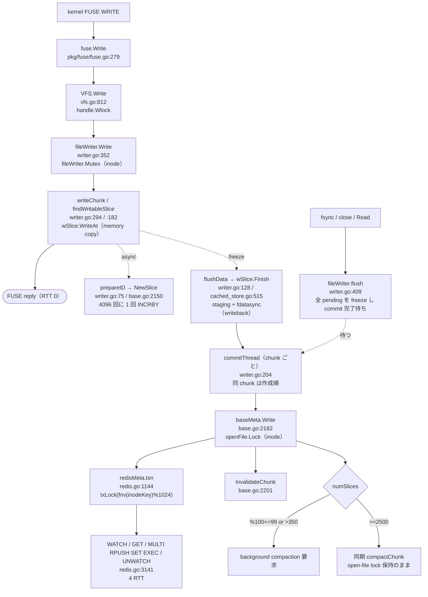
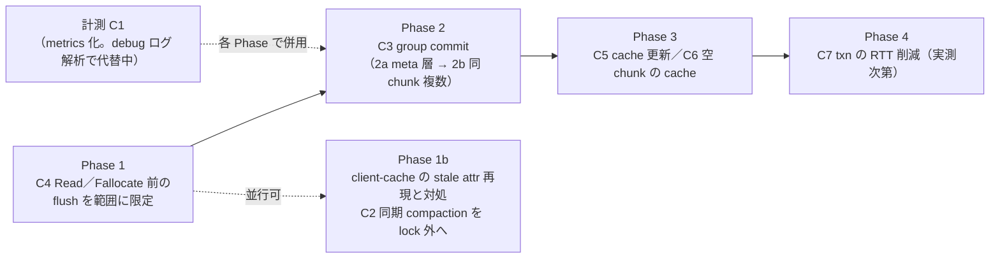

# 巨大ファイル random I/O 向け metadata path 最適化：調査結果と実装計画

作成: 2026-10-07。対象: `tongsama/juicefs` の `1.4.1-improve-kaz`（HEAD `ea2c3757`、tree は `release-1.4.1-kaz.2` = `9268beb4` と同一）。upstream 基準は v1.4.1（`0b90c7db`）。
状態: **調査完了・計画段階（実装未着手）**。本文中の `pkg/…`・`cmd/…` は本体 `juicefs/` 基準。
根拠の詳細（file:line 付き）: [A write path](../../../metadata_random_io/2026-10-07/A_write_path.md)／[B Meta.Write・lock・Redis](../../../metadata_random_io/2026-10-07/B_meta_write_lock.md)／[C read・cache](../../../metadata_random_io/2026-10-07/C_read_cache.md)／[D metrics・計測手段](../../../metadata_random_io/2026-10-07/D_metrics.md)。

表記: **[事実]** = ソースで確認、**[推論]** = ソースからの推論、**[未確認]** = 実機・実行で未確認。

---

> **2026-10-07 実測による更新（最優先で読むこと）**: unsafe でのインストール計測（[解析報告](../../../metadata_random_io/2026-10-07/install-report-ja.md)）で、最大の待ちは **qcow2 の cluster 割り当てに伴う `fallocate(ZERO_RANGE)`** だった。15,343回、合計 3,330s、平均 217ms。そのうち 173ms は `VFS.Fallocate` が範囲に関係なく同 inode の全 pending を commit し終えるまで待つ flush で、強制 freeze の89%もこれが原因だった。
> commit 自体（平均 43ms ≒ 4 RTT、62,317件）も、計測時間の52%を占めた。
> 同条件の **raw では約36分（qcow2 は約84分）**で、fallocate は0回だった。raw で残る最大の待ちは Read 前の flush（合計799s、最大24.8s）。
> このため、実装順を変更した（§7）。**Phase 1 =「Read／Fallocate 前の flush を範囲に限定（C4）」を最優先**とし、その次に group commit（C3）とする。Redis の RTT は実測 9.7〜10.5ms。client-cache は実機で有効だった。
> §1 の「推奨実装順」「効果の定量」は計測前の見立てで、改訂後の順番は §7、見込みは §10 を正とする。

## 1. Executive Summary

### 結論

1. **最大のボトルネック候補は「同一 inode の metadata commit が client 内で完全に直列化され、1 slice ごとに約 4 RTT を払う」こと。** [事実＋推論]
   - 4KiB random write は、ほぼ 1 write = 1 slice になる（`writer.go:182` `findWritableSlice`）。
   - 1 slice の commit（`Meta.Write`）は Redis で `WATCH` → `GET` → `MULTI…EXEC` → `UNWATCH` の **4 RTT**（`redis.go:3141`、go-redis の `Tx.Close` が `UNWATCH` を送る）。
   - 同一 inode の commit は `openFile.Lock`（`base.go:2195`）と Redis `txLock(fnv(inodeKey))`（`redis.go:1162`）の**二重の inode 単位 lock** で直列化される。upstream Issue #6398 の指摘はこの fork にもそのまま該当する。
   - したがって 1 inode あたりの commit 上限は **約 1/(4×RTT) slice/s**（RTT 1ms で約 250/s ≒ 1MB/s、RTT 10ms で約 25/s）。
   - FUSE write 自体は memory copy で返る（RTT 0）。しかし **fsync・close・Read は同 inode の全 pending commit 完了を待つ**ため、`pending 数 × 4 RTT` がそのまま fsync／Read の待ちになる。pending が 800 を超えると writer が freeze を強め、1000 以上では Write 自体も止まる（`writer.go:353`）。
2. **仮説1（NewSlice が毎回 RTT）は否定。** 既に `sliceIdBatch = 4096` 単位の client 側予約がある（`base.go:51`、`base.go:2150`）。1 slice あたり約 1/4096 RTT で、非同期 goroutine から呼ばれ FUSE write をブロックしない。改善余地は軽微。
3. **仮説2（inode-wide lock）は該当。ただし「chunk 単位 lock に narrow するだけ」では Redis の直列化は解けない。** [事実]
   - `txLock` が inode key の hash で直列化する。
   - overwrite でも毎回 `SET inode`（mtime/ctime 更新）するため、並列化しても `WATCH inode` が衝突して retry になる。
   - よって**並列化より「まとめて 1 txn で commit する（group commit）」方が RTT × 回数を直接減らせる**。
4. **仮説3（自分の write 後の chunk cache invalidate）は該当し、さらに広い。** [事実]
   - 自分の commit 後に該当 chunk の cache を消す（`base.go:2201`）ので、直後の Read は `LRANGE` 1 RTT 以上。
   - さらに、自分の Write で Redis 上の mtime が進むため、次の GetAttr の `of.Update` が **ファイル全体の chunk cache を消す**（`openfile.go:187`）。
   - Read の前には、読む範囲と無関係に **同 inode の全 pending を flush**する（`vfs.go:799` → `writer.go:409`）。
5. **仮説7（client-side cache）は hot path にほぼ効かない。** [事実]
   - `client-cache` は meta URL の query param で、upstream 由来。fork による改修はない。
   - cache するのは inode attr と dir entry だけで、chunk（LRANGE）は対象外。
   - 書き込み中の inode は毎 commit で invalidate される。
   - **有効時に doWrite が古い attr を読む潜在的な正しさの問題**がソース上成立する（§5.4）。実装前に再現確認が必要。
6. **同期 compaction（slices ≥ 2500）を `openFile.Lock` 保持のまま実行している**（`base.go:2215-2221`）。その間、inode 全体の commit と cache miss Read が止まる。実機で 9.7 秒の例がある（`option_effects/2026-10-03/health_vm-io-20261002-145808.json` の `sync_metadata_writes_ge2500`）。

### 推奨実装順（計測前の案。改訂後は §7）

| Phase | 内容 | 理由 |
|---|---|---|
| 0 | **計測（metrics）と RTT 実測** | Redis RTT・commit 数・fsync あたり pending 数が未計測。効果予測と効果確認の両方に必須 |
| 1 | **同期 compaction を open-file lock の外へ**／client-cache の正しさ確認 | 低リスク・小変更。tail latency と正しさの前提を固める |
| 2 | **per-inode group commit（Meta.Write のまとめ commit）** | 「RTT × 回数」を直接減らす本命。同期・原子性を保ったまま、遅延を加えない |
| 3 | Read 経路：flush 範囲の限定、自分の commit 結果で chunk cache を更新 | read-after-write の RTT と停止を減らす |
| 4 | Redis txn の RTT 削減（WATCH+GET の pipeline、Lua 化） | group commit 後の残差に応じて判断 |
| 保留 | chunk 単位 lock、NewSlice の非同期 prefetch | 効果が小さい、または group commit で代替される |
| 不採用 | 遅延（非同期）metadata commit | fsync 成功後の crash で消える／read-after-write を壊す。方針に反する |

ユーザー提示の Priority S「NewSlice batch reservation」は既に実装済みなので外した。「inode lock の scope 縮小」は単独では Redis で効かないので保留へ下げた。代わりに Priority B だった「metadata Write batching」を、遅延なしの group commit として Phase 2 に上げた。

### 効果の定量（式。RTT は [未確認]）

r = Redis RTT、N = fsync 時点の同 inode の pending slice 数、K = それらが散らばる chunk 数、B = batch 上限とする。

| 指標 | 現状 | Phase 2 後（目安） |
|---|---|---|
| fsync の metadata 待ち | N × 4r（直列） | ⌈N / B⌉ × 4r（Phase 2a のみなら「1 chunk 内の最大 slice 数」× 4r） |
| 1 inode の commit 上限 | 1/(4r) slice/s | B/(4r) slice/s（Redis・CPU 側の上限まで） |
| NewSlice | 1/4096 RTT/slice（既に batch） | 変更なし |
| 自分の write 直後の Read | flush 待ち + LRANGE 1 RTT + GetAttr で全 chunk cache 消去 | Phase 3 で LRANGE 0 RTT（commit 応答に同梱） |

参考: 既存ログの slow WARN では Redis txn の `active ≈ 38ms`、doWrite 42〜46ms の例がある（`incident_recurrence/2026-10-02/all_slow_redis_txn.txt`、agent_memo の 10/01 解析）。これは 1 秒以上の外れ値だけの記録で、平常時の RTT ではない。仮に r ≈ 10ms なら、1 inode の commit 上限は約 25 slice/s となる。Ubuntu インストール 1 時間の相当部分が commit 待ちである可能性はあるが、**Phase 0 の実測までは断定しない**。

---

## 2. Current Write Path

| 段階 | file:line | metadata access | network RTT | lock |
|---|---|---|---|---|
| FUSE Write | `fuse.go:279` | no | no | no |
| VFS Write | `vfs.go:812` | no | no | `handle.Wlock`（handle） |
| fileWriter.Write | `writer.go:352` | no | no（背圧・flush 中は間接待ち） | `fileWriter.Mutex`（inode） |
| slice へ copy | `writer.go:150` | no | no | 同上 |
| **FUSE reply** | — | — | **0** | — |
| NewSlice | `base.go:2150` | yes（counter） | 4096 回に 1 回、非同期 | `freeMu`（client global、RTT 中も保持） |
| staging／upload | `cached_store.go:515`、`disk_cache.go:853` | no | writeback では local disk のみ | なし |
| commitThread | `writer.go:204` | yes | Meta.Write を待つ | chunk 単位の直列、待機中は `fileWriter.Mutex` |
| Meta.Write | `base.go:2182` | yes | **4 RTT**（hardlink は 5） | **`openFile.Lock`（inode）** |
| Redis txn | `redis.go:1144` | yes | 同上 | **`txLock`（inode key hash、1024 stripe）** |
| InvalidateChunk | `base.go:2201` | no | no（次の Read で LRANGE） | `openfiles.Mutex`（global、短時間） |
| 同期 compaction | `base.go:2215` | yes | 多数＋object I/O | `openFile.Lock` 保持のまま |
| Flush／fsync | `writer.go:409` | 間接 | N × 4 RTT（直列） | `fileWriter` cond、flush 中は同 inode の Write を止める |

fork 改修（reuse window、flush wait/idle、writer flush timeout、trace）は metadata の呼び出し列を変えていない [事実]（`git diff 0b90c7db HEAD -- pkg/vfs pkg/fuse`）。

---

## 3. Current Read Path

| 段階 | file:line | metadata access | network RTT | lock |
|---|---|---|---|---|
| FUSE Read | `fuse.go` | no | no | — |
| VFS Read → **writer.Flush(ino)** | `vfs.go:791-799` | 間接 | pending があれば N × 4 RTT | `handle.Rlock`（同 handle の Write を止める） |
| fileReader／sliceReader | `reader.go` | — | — | reader 内部 lock |
| Meta.Read | `base.go:2101-2143` | chunk cache を参照 | hit: 0 / miss: `LRANGE` 1 RTT | `openFile.RLock`（Write の commit 中は待つ） |
| 未書き込み chunk | `base.go:2127` | 空リストは cache しない | 毎回 LRANGE + GET inode の 2 RTT | 同上 |
| object GET／disk cache | `pkg/chunk` | no | object storage | — |

- chunk cache（`openfiles`）は `--open-cache` に関係なく `Open` で必ず作られる（`base.go:2091`）。期限はなく、消えるのは invalidate のときだけ [事実]。
- `--open-cache=0`（既定）では attr を毎回 Redis から引き、`of.Update` が mtime の変化を検出すると全 chunk を消す（`openfile.go:178-196`）[事実]。書き込みが続く VM image では、attr cache 切れ後の GETATTR のたびに全 chunk cache が消えると推論する。
- doRead は `LRANGE c<ino>_<indx> 0 -1` 1 回だけ（`redis.go:3098`）。buildSlice は最悪 O(n²) だが n ≤ 2500 で、RTT が支配的と推論。

---

## 4. Metadata Backend Operation Count（Redis）

| API | Redis command | RTT | 備考 |
|---|---|---|---|
| NewSlice | `INCRBY nextchunk 4096`（4096 回に 1 回） | 1/4096 | ChangeLog 有効時は IncrBy が pipe の外で +1 RTT（`redis.go:495`、upstream） |
| Write | `WATCH i` / `GET i` / [`HGETALL p`] / `MULTI RPUSH c SET i [INCRBY usedSpace] [changelog] EXEC` / `UNWATCH` | **4**（hardlink 5） | command 7〜10。dir stat・quota はメモリに積んで周期 flush（同 txn 外）。overwrite でも `SET i` は必須（mtime/ctime） |
| Read | `LRANGE c 0 -1` | cache miss 時 1 | 空 chunk は + `GET i` |
| GetAttr | `GET i` | open-cache 0 なら毎回 1 | client-cache 有効時は hit で 0 |
| Truncate／Fallocate | WATCH 系 txn | 4 前後 | open-file lock 下、全 chunk invalidate |
| compaction | LRANGE + NewSlice + object I/O + WATCH chunk txn + 削除 | 多数 | 書き込みの激しい chunk では WATCH 衝突で retry しやすい [推論] |

SQL／TKV（参考）[事実]:
- SQL の Write は約 7〜8 RTT と COMMIT 時の fsync がかかる。PostgreSQL／SQLite では chunk の blob 全体を毎回読み直して書き直す（slice 数に比例）。`FOR UPDATE` で backend 側でも直列になる。SQLite は client 内の全 txn を直列にしている（`sql.go:1237-1240`）。
- TKV は約 2〜4 RTT で、chunk value 全体の読み書き（O(n)）。
- remote PostgreSQL が遅かった過去の観測とは整合する [推論]。

---

## 5. Lock Analysis

### 5.1 一覧

| lock | scope | protected state | contention target | can narrow? | risk |
|---|---|---|---|---|---|
| `openFile.RWMutex`（`base.go:2195`） | inode・client 内。Write/Truncate/Fallocate/CopyFileRange(fout) が W、Read が R | **chunk cache と backend commit の順序**（Read の doRead→CacheChunk と Write の commit→InvalidateChunk を交差させない）、Write 系の client 内排他 | 同 inode の別 chunk の Write、cache miss Read | 条件付き可（inode RW + chunk stripe の 2 階層） | stale chunk cache による read-after-write 破れ |
| Redis `txLock`（`redis.go:1162`） | `fnv(keys[0]) % 1024`、txn 全体（retry 含む） | 同 key の client 内 WATCH 衝突の回避（性能目的） | 同 inode の全 txn、hash 衝突した他 key | 単独では無意味（inode key を SET する限り衝突） | 外すと client 内で retry storm |
| Redis `WATCH inodeKey` | inode、client 間 | length/mtime/ctime と RPUSH の組の整合 | 他 client・compaction | Lua 化で置換可能 | 外すと length の lost update |
| `fileWriter.Mutex`（`writer.go:257`） | inode、全 handle 共有 | pending slice 状態 | Write・flush・commitThread 待機 | 不要（Meta.Write 中は解放済み） | — |
| `handle` R/W lock（`handle.go:102-149`） | handle | handle の reader/writer | 同一 fd の Read と Write | 対象外 | — |
| `m.compacting` busy-wait（`base.go:2847-2868`） | client 全体 | 同 chunk compaction の重複防止 | 同期 compaction 待ち | **f.Lock の外へ移すべき** | f.Lock 保持中の長時間停止 |
| `freeMu`（`base.go:322`） | client global | slice ID／inode ID の予約 | 4096 回に 1 回の RTT 中、NewSlice と inode 採番 | prefetch で短縮可能 | 小 |
| `compactionScheduler.mu`（fork） | client 全体、短時間 | job map、per-inode active 1 | Write からの hint | 問題なし | 巨大 1 ファイルでは compaction 並列度が 1 |

### 5.2 baseMeta.Write の open-file lock が守っているもの [事実]

- **守っていない**: length、mtime、slice list（backend txn が守る。`f == nil` なら lock なしで Write する設計）。open-file cache の各フィールド（global の `openfiles.Mutex` が守る）。dir stat・quota（各専用 mutex）。
- **守っている（本質）**: 「Read が backend から読んだ古い list を、Write の commit→InvalidateChunk の後に cache へ入れてしまう」ことの防止。`InvalidateChunk` は defer の順序で unlock より前に実行される。**単純に `f.Lock()` を外すと read-after-write が壊れる。**
- 必要なのは chunk 単位の排他と、全 chunk を invalidate する操作（Truncate／Fallocate／CopyFileRange）との排他であり、inode 全体ではない。

### 5.3 lock order と deadlock [事実]

- 順序は常に `openFile.Lock → txLock → openfiles.Mutex` の一方向。deadlock 経路は見つからなかった。
- 背景 compaction（legacy／priority scheduler）は open-file lock を取らない。
- 同期 compaction は f.Lock を持ったまま `m.compacting` を busy-wait する。待たれる側は f.Lock を要しないので deadlock ではない。ただし相手の object I/O の時間だけ inode 全体が止まる。
- multi-client では local mutex は無力で、Redis の WATCH だけが整合を担保する。

### 5.4 付随して見つかった正しさのリスク [未確認：要再現]

- **client-cache 有効時の stale attr**:
  - doWrite 内の `tx.Get(inode)` は、go-redis の Tx が hook を引き継ぐため（`go-redis tx.go:29`）、client-cache から返り得る（`redis_csc.go:186-197`）。
  - 一方、自分の commit の `SET` は TxPipeline 内で、pipeline hook が nil なので（`redis_csc.go:271`）local cache が消えない。
  - BCAST の invalidation が届く前に次の commit が走ると、`WATCH` は通るが古い Length を基に `SET` し、**ファイル長が後退**する可能性がある。
  - upstream 由来の潜在問題。実機の meta URL に `client-cache` が無ければ影響しない。Phase 1 で使用有無の確認と再現テストを行う。
- Read が `f.attr.Tier` を `openfiles.Mutex` の外で読んでいる（`base.go:2133-2138`）。data race の可能性あり（小）。
- `bgjob` 系 metric 名の prefix 二重化（`juicefs_juicefs_bgjob_*`、upstream）。

---

## 6. Optimization Candidates

### C1. metadata 計測の追加（Phase 0）

- **目的**: RTT・回数・lock 待ち・fsync あたり pending 数を分離して測る。
- **現状**: op 別は `meta_ops_total{method}` と合計秒だけで p95/p99 が取れない。NewSlice・Open・Close は未計測。lock 待ちは 1 秒以上の WARN ログだけ。mutex/block profile は無効。
- **変更案**（既存の名前・型は変えずに追加。詳細は [D §5](../../../metadata_random_io/2026-10-07/D_metrics.md)）:
  - `juicefs_meta_op_durations_seconds{method}` histogram、`juicefs_meta_op_errors_total{method,errno}`（`timeit` の拡張、`base.go:621`）
  - NewSlice（refill 時のみ）・Open・Close の計測
  - `juicefs_meta_openfile_lock_wait_seconds{method}`（fork 既存の `lockWait` を Observe）
  - `juicefs_transaction_lock_wait_seconds`、`juicefs_transaction_attempts`
  - `juicefs_meta_redis_cmd_duration_seconds{cmd}`（go-redis hook。`redis_csc.go:96` と同じ方式）。**純 RTT の軸**
  - `juicefs_meta_chunk_slices{method}`（commit 時の numSlices）、`juicefs_meta_compaction_total{trigger,result}`、compaction phase、scheduler の drop 数
  - vfs: `juicefs_writer_commit_duration_seconds`、`juicefs_writer_flush_duration_seconds{origin}`、**`juicefs_writer_flush_pending_slices{origin}`**（flush 開始時の pending 数）、`juicefs_writer_slice_freeze_total{reason}`
  - staging の fdatasync 時間（`--writeback-fsync` の寄与を metadata と分けるため）
  - 任意: mount オプションで `runtime.SetMutexProfileFraction`／`SetBlockProfileRate` を有効化
  - 任意: 低頻度の Redis PING による RTT gauge
- **ラベル**: inode・key・slice id はラベルにしない。backend 種別は `--custom-labels` で付ける。series は約 1,400。
- **overhead**: `time.Now` と Observe は数十 ns で、RTT に対して無視できる [推論]。
- **リスク**: 低。I/O の意味論を変えない。
- **テスト**: 既存 metrics テストの拡張、`juicefs mdtest` で `/metrics` に出ることを確認。

### C2. 同期 compaction を open-file lock の外へ（Phase 1）

- **目的**: slices ≥ 2500 のとき inode 全体が止まる時間を、その chunk の commitThread だけに限定する。
- **変更**: `baseMeta.Write`（`base.go:2214-2221`）で、`numSlices >= maxSlices` のときは compaction 要否だけを記録する。`f.Unlock()` と `InvalidateChunk` の後に `compactChunk(once=true)` を呼ぶ（defer の順序を明示的な関数呼び出しに組み替える）。
- **維持するもの**: 呼び出し元 commitThread への back-pressure（同期で待つ点は同じ）、同 chunk の重複防止（`m.compacting`）。
- **排他**: compactChunk は元々 open-file lock を取らない設計（背景版と同じ条件になる）。
- **crash／multi-client**: 変化なし（compaction の txn は元のまま）。
- **テスト**: 2500 到達中に別 chunk の Write と Read が進むことの回帰テスト（MemKV／Redis）。既存の compaction・GC テストの再実行。
- **リスク**: 低。**難易度**: 小。

### C3. per-inode group commit（Phase 2、本命）

- **目的**: 同 inode の commit をまとめ、「RTT × 回数」を減らす。遅延を足さない（待ち行列にあるものだけをまとめる）。
- **現状**: chunk ごとの commitThread は既に並行して `Meta.Write` を呼ぶが、inode lock で 1 件ずつ直列になる（#6398 の状況そのもの）。

**Phase 2a: meta 層の group commit（VFS は無変更）**
- `openFile` に `wq []*writeReq` と小さな mutex を追加する。
- `baseMeta.Write` は自分の要求を `wq` に積んでから `f.Lock()` を取る。取れた時点で、
  - 自分の要求が前の leader によって完了済みなら、結果を受け取って返る。
  - 未完了なら leader として `wq` を上限 B 件まで取り出し、`doWriteBatch` を 1 回実行し、各要求に結果を配る。
- 同 chunk の要求は、commitThread が前の Write の戻りを待ってから次を出すので、1 batch に 1 chunk 1 件まで。→ **同 chunk 内の作成順は自然に保たれる**。
- Redis `doWriteBatch`: `WATCH i` / `GET i` / `MULTI { RPUSH c_k slice_k … ; SET i attr ; [INCRBY usedSpace] ; [changelog × n] } EXEC` / `UNWATCH`。
  - length は要求順に逐次計算する。mtime は最後の要求の値、ctime は now。
  - 各 RPUSH の戻り値を、その chunk の numSlices として compaction 判定に使う。
- `f == nil`（open-file 未登録）や batch 無効時は従来の `doWrite` 経路。
- engine が `doWriteBatch` を持たない場合は、leader が `doWrite` を順に呼ぶ（意味論は同じで RTT は減らない）。初版は Redis のみ実装。SQL（COMMIT・fsync が 1 回になるので効果大）と TKV は後続。

**Phase 2b: 同 chunk の複数 slice を 1 要求に（VFS 変更）**
- commitThread（`writer.go:204`）が、先頭から連続して done（かつ dep 充足）な slice を最大 B 件まとめて 1 要求として出す。
- `s.dep`（前 chunk の growing slice の commit 待ち）は従来どおり満たしてから出す。
- 成功したら、まとめた全 slice を committed にする。

**正しさの検討**
- **原子性**: batch は all-or-nothing（Redis MULTI/EXEC、WATCH 衝突なら batch 全体を retry）。従来は 1 件ずつ見えたが、batch 内はまとめて見える。どちらも fsync 応答前の状態なので、POSIX の保証は変わらない [推論]。
- **エラー**:
  - batch が errno（ENOSPC／EDQUOT／ENOENT／EIO 等）で失敗したら、**その batch を従来の 1 件ずつの commit に戻して再実行**し、各要求に正確な errno を返す。commitThread のエラー処理（`writer.go:236-245`）を変えない。
  - quota は batch の合計 delta で事前判定するので、失敗時は 1 件ずつに戻ることで従来と同じ結果になる。
- **crash consistency**: データの staging（fdatasync）→ commit の順序は変わらない。commit 前の crash では、従来どおりその slice は見えない。batch の場合は「batch 全体が見えない」になるだけ。fsync 成功を返す前に全 commit 完了を待つ点は不変。
- **multi-client**: WATCH inode の保護は同じ。txn 数が減る分、衝突も減る [推論]。
- **read-after-write**: leader は open-file lock を保持したまま commit と全 chunk の InvalidateChunk を行う。§5.2 の不変条件は保たれる。
- **compaction**: chunk 単位の WATCH chunkKey は compaction 側だけで、doWrite は WATCH しない（RPUSH のみ）。従来と同じ。
- **txn サイズ**: B の既定は 64 程度。payload は 1 slice 24B + attr なので小さい。

**その他**
- **互換性**: metadata format は不変。dump/load・fsck・gc に影響なし。旧 client と混在しても可（同じ key 操作を同じ txn 形式で行うだけ）。
- **オプション**: `--meta-write-batch=<N>`（0 = 無効。初版は既定 0）。後述の large-file モードで有効化する。
- **変更ファイル**: `pkg/meta/openfile.go`（wq）、`pkg/meta/base.go`（Write の leader/follower、`engine` に任意の `doWriteBatch` interface）、`pkg/meta/redis.go`（`doWriteBatch`）、`pkg/meta/config.go`（Config）、`cmd/flags.go`／`cmd/mount.go`（flag）。2b では `pkg/vfs/writer.go`（commitThread）と `pkg/meta/interface.go`（`WriteSlices` の追加。既存 `Write` は残す）。
- **期待効果**: fsync の metadata 待ちは `N × 4r` から「K 個の chunk が並行するなら約 ⌈N/K⌉ × 4r」（2a）、さらに `⌈N/B⌉ × 4r`（2b）へ。
- **リスク**: 中（エラー時の 1 件ずつへのフォールバック、leader と follower の完了通知の実装）。**難易度**: 中。

### C4. Read／Fallocate 前の flush を範囲に限定（Phase 1、最優先。実測で昇格）

- **目的**: Read と Fallocate の前に、同 inode の**全** pending ではなく、対象範囲と重なる chunk の pending だけを commit してから処理する。
- **実測の根拠**（[解析報告](../../../metadata_random_io/2026-10-07/install-report-ja.md)）:
  - qcow2（prealloc=off）: Fallocate 前の flush が 15,343回、合計 2,661s（Fallocate 全体 3,330s の80%）。強制 freeze の89%。
  - raw: Read 前の flush が 32,205回、合計 799s、最大 24.8s。flush 中の Write 停止による write の1秒超が31回（121s）。
- **現状** [事実]:
  - `VFS.Read`（`vfs.go:799`）と `VFS.Fallocate`（`vfs.go:907`）が `writer.Flush(ino)` を呼ぶ。
  - `fileWriter.flush`（`writer.go:409`）は、全 chunk の全 slice を freeze し、`len(f.chunks)==0` になるまで待つ。その間は `flushwaiting` で同 inode への新しい Write も止める。
  - commit は chunk ごとの commitThread で直列（1件 約41〜43ms）。flush の待ち時間 ≒ 未 commit 数 × 約43ms ＋ lock の順番待ち。

**変更内容**

1. `pkg/vfs/writer.go`
   - `fileWriter.flushRange(ctx, off, size)` を新設する。`f.Lock` の下で次を行う。
     - 対象 chunk = `[off/ChunkSize, (off+size-1)/ChunkSize]` のうち、`f.chunks` に存在するもの。
     - **待つ集合** = 対象 chunk の、その時点の全 slice（ポインタの snapshot）。さらに依存の閉包を加える。各 slice の `s.dep`（前 chunk の growing slice）について、dep を含むその chunk の先頭から dep までの slice を加え、再帰的にたどる。commitThread は同 chunk 内で作成順に commit し、dep の commit も待つので、閉包を freeze しないと timer（30s/16s）まで進まない。
     - 待つ集合をすべて freeze する（理由 `explicit_flush`、origin は呼び出し元）。
     - 待つ集合の全 slice が `committed` になるか、`f.err` が立つまで待つ。flush と同じ deadline、取消、5分ごとの WARN の扱いを共通化する（待ちの条件を述語として渡すヘルパーに切り出す）。
     - **`flushwaiting` は増やさない**（同 inode の他の範囲への Write を止めない）。新しい Write が対象 chunk に来ても、待つ集合は snapshot なので飢餓にならない。
   - commitThread: `s.committed = true` の後、`f.rangewaiting > 0` なら `flushcond.Broadcast()` する（現状は全 chunk が空になったときだけ通知）。
   - `dataWriter.FlushRange(ctx, inode, off, size)` を追加する。
   - **`fileWriter.Truncate` の扱い**: 現状は `f.length = length` で無条件に上書きする（`writer.go:504-509`）。範囲を限定すると、範囲外に未 commit の追記があるとき、Meta.Fallocate が返す長さが writer の長さより短くなり得る。そこで、Fallocate 用に「縮めない」`GrowTo(length)`（`max(f.length, length)`）を追加し、Fallocate はそれを使う（fallocate はファイルを縮めない）。Truncate の経路は従来どおり全 flush と上書き。
2. `pkg/vfs/vfs.go`
   - `VFS.Read`: scope=range なら `v.writer.FlushRange(ctx, ino, off, len(buf))`。
   - `VFS.Fallocate`: scope=range なら `FlushRange(ctx, ino, off, size)`。その後の `writer.Truncate` を `GrowTo` に替える。
   - fsync、flush（close）、Release、Truncate、SetAttr、CopyFileRange、FlushAll は**従来どおり全 flush**（fsync の意味を弱めない）。
3. `pkg/vfs/vfs.go` の Config、`cmd/flags.go`、`cmd/mount.go`: `--writer-flush-scope=file|range`（既定 file）。large-file モードで range にする。

**正しさの検討**

- Read の read-after-write: reader が `Meta.Read` で参照するのは、読む範囲と重なる chunk だけ。その chunk で Read の開始前に返った Write は、すべて待つ集合に入っており、commit 済みになってから読む [推論]。Read と並行して後から来た Write は、従来も順序を保証していない。
- ファイル長: reader と writer の長さは、Write のたびにローカルで更新される（Meta の長さを待たない）ので、範囲外の未 commit の追記があっても EOF の判定は変わらない [推論、要テスト]。
- Fallocate（ZERO_RANGE／PUNCH_HOLE）: ゼロ化（slice id 0 の記録）は、範囲と重なる既存の書き込みより後に記録される必要がある。重なる chunk の pending は先に commit 済みになる。範囲外の pending は後から commit されても範囲が重ならないので、chunk の slice list 内の順番は結果に影響しない。長さは「max を取る」更新なので、commit の順番が入れ替わっても同じ値になる [推論、要テスト]。
- 先読み（readahead）: 範囲外の chunk を、未 commit の書き込みがある状態で先読みすると、古い metadata のデータがバッファに入り得る。その範囲を後で読むときは、range flush の commit が `reader.Invalidate` を呼んでから committed になる（`writer.go:231` → `:247`）ので、古いバッファは捨てられる [推論]。**読み込み中のバッファとの競合はテストで確認する**（現状の全 flush でも、Write 時の Invalidate と並行する先読みとの間に同種の競合はある）。
- エラー: `f.err`（同 inode の過去の commit 失敗）は、範囲に関係なく返す（従来と同じく保守的に）。実際の保存失敗を隠さない。
- crash consistency／multi-client: commit の内容と順序（同 chunk 内）は変わらず、fsync の保証も変わらない。待つ範囲が変わるだけ。

- **変更規模**: 小〜中（writer.go 約100行、vfs.go 数行、flag）。**リスク**: 中（依存の閉包と待ちの通知）。
- **期待効果**（今回の計測から）: qcow2 は Fallocate 前の flush（2,661s）の大部分が消え、強制 freeze が減って slice が大きくなり、commit と compaction も減る。raw は Read 前の flush（799s）と、それに伴う Write の停止（121s）の大部分が消える。

### C5. 自分の commit 結果で chunk cache を更新（Phase 3）

- **目的**: 自分の write 直後の Read の LRANGE（1 RTT）と、GetAttr による全 chunk cache 消去を減らす。
- **変更**:
  1. doWrite（または doWriteBatch）の MULTI に、RPUSH の後の `LRANGE c 0 -1` を同梱する。EXEC の原子的なスナップショットで、その chunk の cache を**丸ごと置き換える**。追加の RTT はなく、他 client の追記や compaction があっても正しい。
  2. commit で書いた mtime を `of.attr` に反映する。ただし tx で読んだ旧 mtime が `of.attr` と一致した場合に限る。不一致なら他者の変更があったとみなし、従来どおり invalidate する。
- **フォールバック（従来の invalidate）**: numSlices が閾値（例 500）を超える、エラー、Truncate／Fallocate／CopyFileRange、compaction 完了、batch のフォールバック時。
- **不採用案**: cache 側で既存リストに新 slice を重ねる方式。世代番号がなく、remote compaction 等で不整合になる。
- **リスク**: 中（open-cache の意味論との整合）。前提として C3 の実装後に行うのが効率的。

### C6. 未書き込み chunk の空結果を cache（Phase 3、小）

- `base.go:2127` で空リストを cache しないため、sparse な qcow2 の未割り当て領域を読むたびに 2 RTT かかる。空リストも cache し、invalidate は既存経路（Write／Truncate 等）に任せる。
- open-cache の意味論は非空リストと同じ [推論]。

### C7. Redis txn の RTT 削減（Phase 4、条件付き）

- (a) **`WATCH` と `GET` を同じ pipeline で送る**（4 → 3 RTT）。go-redis の API で実現できるか [未確認]。
- (b) **`UNWATCH` の省略**: EXEC 成功後は不要だが、go-redis の `Watch` が必ず送る。接続の扱いを自前化する必要があり侵襲的。
- (c) **Lua（EVALSHA）で non-growing overwrite を 1 RTT に**: Lua 内で `GET i`、type・length の検査、mtime/ctime の書き換え、`RPUSH`、`SET` を原子実行する。growing write、quota が絡む場合、hardlink は従来の txn に戻す。txLock と WATCH が不要になる。
  - 課題: attr のバイナリ形式を Lua 側で扱うこと（`struct` ライブラリ）、cluster の hash tag、Redis 互換実装（Valkey/KeyDB 等）での動作。
- **判断**: C3 の後に残る RTT を計測して決める。mtime 更新をまとめる（間引く）案は、意味論が変わるので不採用。

### C8. chunk 単位の open-file lock（保留）

- inode RW lock の下に chunk stripe を置く 2 階層化。Write と Read は chunk 単位、Truncate・Fallocate・CopyFileRange は inode 全体の W lock。
- Redis では txLock と WATCH inode が残るので、commit の直列化は解けない。効果は Read と Write の並行性だけ [推論]。C3 で leader が lock を持つ時間あたりの処理量が増えるため、優先度は低い。

### C9. NewSlice（軽微、保留）

- 既に 4096 個単位で予約済み。残る改善は、残りが閾値を切ったら次の範囲を非同期で予約すること（`freeMu` を RTT 中に持たない）。効果は 4096 回に 1 回の待ちだけ。
- slice ID の gap は既存実装でも crash 時に発生しており、gc・fsck・dump/load は連続性に依存しない [事実]（`cmd/gc.go:112,307`、`dump.go:571`、`cmd/fsck.go:115`）。

### C10. 遅延（非同期）metadata commit（不採用）

- fsync 成功後でも metadata が未 commit になる、または fsync の意味を弱めることになり、プロジェクト方針（fsync・read-after-write を弱めない）に反する。C3 の「待ち行列にあるものだけをまとめる」は遅延を加えないので、これとは別物。

### large-file モード（オプションの束ね方）

- 個別のフラグ: `--writer-flush-scope=file|range`（C4）、`--meta-write-batch`（C3）、`--meta-chunk-cache-refresh`（C5）。
- まとめて有効にする `--large-file-mode`（プリセット）を追加する。個別フラグの明示指定が優先。
- 既定はすべて従来どおり。C2・C6 と計測は意味論を変えないので、常時有効でよい。
- 小さいファイルへの影響: C3 は同 inode に複数の commit が並んだときだけ効き、単発では従来と同じ経路になる。C4・C5 も pending や open 中のファイルに限られる [推論]。

---

## 7. Recommended Implementation Order（2026-10-07 実測で改訂）

| Phase | 内容 | 根拠（実測） | 主に効く条件 |
|---|---|---|---|
| 1 | **C4 Read／Fallocate 前の flush を範囲に限定** | qcow2: Fallocate 前の flush 2,661s／raw: Read 前の flush 799s | qcow2・raw の両方 |
| 1b | client-cache の stale attr の再現と対処、C2 | 実機で client-cache 有効。2,500 到達は今回0件なので C2 は低め | 正しさ／tail latency |
| 2 | **C3 group commit** | commit 43ms×62,317件（計測時間の52%）、raw でも lock 待ち平均160ms | 両方。Phase 1 の後の律速 |
| 3 | C5・C6 | Meta.Read は 59s と小さい | 小 |
| 4 | C7 | Phase 2 の後の残差で判断 | — |

- 各 Phase の後に、同じ条件（raw と qcow2 prealloc=off、unsafe、ISO はローカル）でインストールを計測する。所要時間の比較用には `--debug` なしの回も取る。
- writeback（QEMU の cache）では fsync の待ちが加わる。Phase 2 の効果確認で writeback の回も測る。
- 計測（C1）は、当面は debug ログと accesslog の解析（`metadata_random_io/2026-10-07/analyze_install.py`）で代替できている。metrics 化は Phase 2 と並行して入れる。

---

## 8. Concrete Patch Plan

| ファイル | 関数・箇所 | 変更 | Phase |
|---|---|---|---|
| `pkg/meta/base.go` | `newBaseMeta`、`InitMetrics`（:610）、`timeit`（:621） | op histogram・errors・lock wait・chunk slices・compaction counter の追加 | 0 |
| `pkg/meta/base.go` | `NewSlice`（:2150）、`Open`、`Close` | 計測（NewSlice は refill 時のみ） | 0 |
| `pkg/meta/redis.go` | `newRedisMeta`、`txn`（:1144） | go-redis の計測 hook、txLock 待ち・attempts の Observe | 0 |
| `pkg/meta/sql.go`／`tkv.go` | txn | txBatchLock 待ち・attempts の Observe | 0 |
| `pkg/vfs/writer.go`、`vfs.go` | `commitThread`、`flush`、`InitMetrics` | commit／flush 時間、flush 開始時の pending 数（origin 別）、freeze 理由 | 0 |
| `pkg/chunk/disk_cache.go` | `stage` | staging fdatasync 時間 | 0 |
| `pkg/meta/base.go` | `Write`（:2182-2225） | 同期 compaction を unlock 後へ移動 | 1 |
| `pkg/meta/redis_csc.go` | `beforeProcess`／pipeline hook | （再現した場合）Tx 内の GET は cache を使わない、または TxPipeline の SET で local cache を消す | 1 |
| `pkg/meta/openfile.go` | `openFile` | `wq` と `wqMu` の追加 | 2a |
| `pkg/meta/base.go` | `Write`、`engine` interface | leader／follower の group commit、`doWriteBatch` の任意 interface、エラー時の 1 件ずつへのフォールバック、chunk ごとの compaction 判定と invalidate | 2a |
| `pkg/meta/redis.go` | `doWriteBatch`（新規） | 1 txn に複数の RPUSH と 1 回の SET | 2a |
| `pkg/meta/config.go`、`cmd/flags.go`、`cmd/mount.go` | Config、flag | `--meta-write-batch`、`--large-file-mode` | 2a |
| `pkg/meta/interface.go` | `Meta` | `WriteSlices(ctx, inode, indx, []SliceWrite)`（既存 `Write` は残す） | 2b |
| `pkg/vfs/writer.go` | `commitThread`（:204） | 連続して done の slice をまとめて commit | 2b |
| `pkg/vfs/writer.go` | `flushRange`（新設）、`flush` の待ちループの共通化、`commitThread`（committed 後の通知）、`GrowTo`（新設）、`dataWriter.FlushRange` | C4 の範囲 flush | 1 |
| `pkg/vfs/vfs.go` | `VFS.Read`（:799）、`VFS.Fallocate`（:907, :914）、Config | scope=range で FlushRange、Fallocate 後は GrowTo | 1 |
| `cmd/flags.go`、`cmd/mount.go` | flag | `--writer-flush-scope=file\|range` | 1 |
| `pkg/meta/redis.go`、`base.go`、`openfile.go` | `doWrite(Batch)`、`Write`、`Update` | MULTI 内の LRANGE で cache を置き換え、`of.attr` の mtime を条件付きで進める | 3 |
| `pkg/meta/base.go` | `Read`（:2127） | 空 chunk の cache | 3 |
| `pkg/meta/sql.go`／`tkv.go` | `doWriteBatch` | SQL・TKV 版（1 COMMIT） | 2 以降 |
| `pkg/meta/redis.go`、`lua_scripts.go` | Lua の overwrite commit | 条件付きで 1 RTT | 4 |

すべての新規・変更関数には目的のコメントを付ける。各 Phase は独立した commit にする。commit・push はユーザーが行う。

---

## 9. Test Plan

### 9.1 主指標：Ubuntu Desktop 26.04 のインストール時間

- 条件を固定する: 同じ VM 定義、同じ ISO、新規の qcow2（作成オプションを記録）、同じ mount オプション（変更する flag 以外）、同じ Redis 配置。可能なら autoinstall で手順を自動化する。
- 記録する: 総時間（現状 約 1 時間）、metrics の開始・終了時の snapshot（§C1 の全項目と既存の `juicefs_fuse_ops`、object PUT/GET、staging）、Redis RTT（PING gauge か `redis-cli --latency`）。
- baseline は 2〜3 回測り、ばらつきを把握する。改善の判断はばらつきを超えた差だけとする。

### 9.2 micro benchmark（fio は手元に無いので導入が必要）

| workload | 内容 | 狙い |
|---|---|---|
| A | 10GiB へ 4K randwrite、iodepth 32、direct=1、一定間隔で fsync（例 `--fsync=32`） | commit 直列化と fsync 待ち |
| B | 4K randrw 70/30 | Read 前 flush と chunk cache |
| C1 | offset を 1 chunk（64MiB）内に限定 | 同 chunk 内の直列（Phase 2b の効果） |
| C2 | offset を多数の chunk に分散 | 別 chunk 間の並行（Phase 2a の効果） |
| D | Redis RTT を 0.2／1／5／10／20 ms に変えて A〜C | 性能が RTT に比例するか（RTT 依存か、CPU・object・lock 依存かの判定） |

- 各 run で、IOPS、MiB/s、avg/p95/p99 latency、metadata の op/s（NewSlice・Write・Read）、metadata の合計時間/s と p95/p99、open-file lock 待ち、txn lock 待ち、slices/chunk の分布、compaction 回数を記録する。
- RTT の注入手段（D §6）: (1) host の `tc netem`（sudo のためユーザー操作）、(2) docker の redis container 内で netem、(3) toxiproxy、(4) go-redis hook での sleep（テスト専用 build tag）。(2)(3) は image の取得にユーザーの承認が必要。

### 9.3 unit／race テスト

- C2: 2500 到達時の同期 compaction 中に、別 chunk の Write と Read が進む。
- C3:
  - 複数 chunk の並行 Write が 1 txn にまとまり、最終的な slice list・length・mtime が逐次 commit と一致する。
  - 同 chunk の作成順が保たれる。growing write の dep が保たれる。
  - batch がエラーになったとき 1 件ずつに戻り、各 errno（ENOSPC／EDQUOT／ENOENT／EIO）が従来と同じになる。
  - WATCH 衝突で batch 全体が retry される。
  - `f == nil` と batch 無効時は従来経路を通る。
  - quota の境界（batch 合計で超過、個別では一部成功）。
- C4（Phase 1）:
  - 範囲外に pending がある状態で、範囲内の read-after-write が最新を返す（同 chunk／chunk 境界をまたぐ読み取り）。
  - 範囲外の pending は freeze されず、Write も止まらない（flushwaiting が増えない）。
  - growing write の dep が前 chunk にあるとき、閉包が freeze され、timer を待たずに完了する。
  - 範囲外に未 commit の追記がある状態での Fallocate（ZERO_RANGE／PUNCH_HOLE|KEEP_SIZE／mode 0）で、writer と Meta の長さが縮まない。最終内容が全 flush の場合と一致する（同じ操作列を scope=file と range で実行して比較）。
  - ゼロ化範囲と重なる pending が先に commit され、ゼロが優先される。
  - EOF 付近の Read（範囲外の追記が未 commit）。
  - 先読み中のバッファと range flush の commit による Invalidate の競合（race テスト）。
  - `f.err` があるときは範囲外でも errno を返す。既存の `TestVFSReadFlushError` 系を scope=range でも通す。
  - 既存の VFS／FUSE テスト一式を scope=file と range の両方で回す。
- C5: 自分の write → Read が LRANGE なしで最新を返す。他 client の write・compaction の後は invalidate される。
- backend: Redis／SQLite／MemKV（TKV）で同じテストを回す。PostgreSQL は従来どおり source review のみ（ユーザー方針）。
- `go test -race` を対象 package で 3 回。既存の DATA RACE（pkg/chunk の 11 件など）は baseline と比較して増えていないことを確認する。

### 9.4 crash／multi-client

- **crash**: batch commit 中に `kill -9`。再 mount 後に fsck を実行し、fsync 済みの範囲のデータを検証する（書き込みパターンを記録し、最後に成功した fsync までが読めること）。
- **forced unmount／Redis 再接続**: commit 中に Redis の接続を切る（container の pause や toxiproxy）。エラーが隠れず、再接続後に整合していることを確認する。
- **multi-client**: 2 つの client で同 inode の別 chunk に並行で書き、最終的な内容と length を検証する。WATCH retry の回数（`transaction_restart`／attempts）を記録する。
- **dump／load**: Phase 2 以降も metadata format が変わらないことを、dump → load → 内容比較で確認する。

---

## 10. Expected Impact

### 10.1 実測に基づく見込み（2026-10-07）

| 条件 | 現状（debug 付き） | Phase 1 で消える見込みの待ち | Phase 2 の対象 |
|---|---|---|---|
| qcow2 prealloc=off、unsafe | 約84分 | Fallocate 前の flush 2,661s（Fallocate 自身の 43ms×15,343 = 664s は残る）、Read 前の flush 360s の大部分 | commit 43ms×件数（freeze が減るので件数も減る見込み） |
| raw、unsafe | 約36分 | Read 前の flush 799s と Write の停止 121s の大部分 | 同上 |

- これらは FUSE 操作の待ち時間の合計で、並行して起きた分もあるため、所要時間の短縮量とは一致しない。効果は Phase 1 の後の計測で確かめる。
- 運用上の回避策（コード変更なし）: raw（または qcow2 の preallocation=metadata、未計測）を使うと ZERO_RANGE を避けられ、今回は所要時間が半分以下になった。

### 10.2 計測前の目安（式。RTT は約10ms と実測済み）

| r（RTT） | 現状の 1 inode commit 上限 | fsync（N=200 pending、K=50 chunk）現状 | Phase 2a | Phase 2b（B=64） |
|---|---|---|---|---|
| 0.2ms | 約 1,250 slice/s | 160ms | 約 3.2ms | 約 3.2ms |
| 1ms | 約 250 slice/s | 800ms | 約 16ms | 約 16ms |
| 5ms | 約 50 slice/s | 4.0s | 約 80ms | 約 80ms |
| 10ms | 約 25 slice/s | 8.0s | 約 160ms | 約 160ms |

- Phase 2a の欄は「1 chunk に 4 slice ずつ、50 chunk が並行」と仮定した値（4 ラウンド × 4r）。Phase 2b は ⌈200/64⌉ = 4 ラウンドで同じになる。実際は chunk の偏りで変わる。
- NewSlice: 1024 slice あたり、現状でも約 0.25 RTT（4096 個単位の予約）。追加の改善はほぼない。
- 自分の write 直後の Read（Phase 3）: 1 chunk あたり LRANGE 1 RTT → 0。加えて、flush の対象が範囲内の pending だけになる。
- **Ubuntu インストール時間への効果は、Phase 0 で「fsync／Read の待ちのうち commit が占める割合」を測るまで予測しない。** 割合を p とすると、Phase 2 の上限は概ね `1 時間 × p × (1 − 1/まとめ倍率)` の短縮になる。

---

## 11. 未確認事項と前提

- 実機の Redis RTT、meta URL の `client-cache` の有無、`--open-cache`／`--attr-cache` の値、QEMU の cache mode（O_DIRECT か）、guest の fsync 頻度。
- go-redis で WATCH と GET を 1 RTT にまとめられるか。Lua 化の cluster 互換性。
- WSL2 で netem が container から使えるか。fio・redis-server は未導入（導入はユーザーの承認後）。
- 既存の Read EIO 課題（sticky EIO、共有 retry counter）と C4 の相互作用。
- 2026-10-02 にユーザーは「inode-wide lock の構造変更」を対象外とした。今回の依頼で再び対象になった。ただし本計画は lock の分割（C8）ではなく、group commit（C3）を推奨する。
