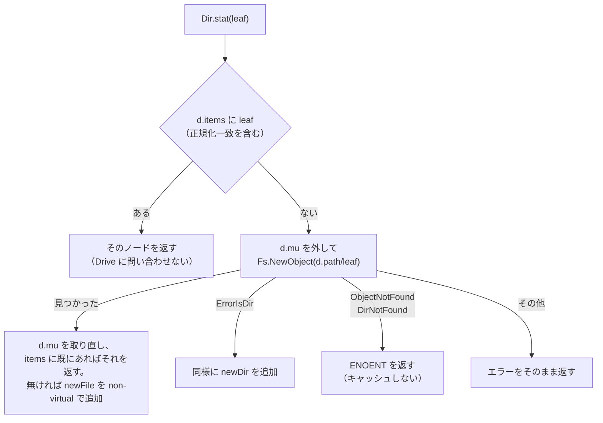

# rclone serve s3 のパス指定 lookup（`--kaz-vfs-lookup-by-path`、Phase 1）設計

- 日付: 2026-10-08
- 状態: 設計（2026-10-08 ユーザー承認済み）。実装済み（rclone `feat/kaz-vfs-lookup` 078531045、push なし）。
- 根拠: [ソース調査](../../../rclone_dir_cache/2026-10-08/source-investigation-ja.md)（file:line と再現テスト）
- 対象: rclone v1.75.1（`rclone/`、687d264b6）。ブランチ `1.75.1-improve-kaz`。fork `tongsama/rclone` は未作成。
- 後続: Phase 2（S3 ユーザーメタデータを Drive の properties に保存）、Phase 3（release 構成を JuiceFS と rclone の2成果物に対応）。どちらも別の仕様にする。

## 1. 目的と前提

**構成**: 複数のホストが、それぞれ `rclone serve s3 gdrive_kwatan:/rclone-s3 --poll-interval 0 --dir-cache-time 1h --vfs-cache-mode off --low-level-retries 1 ...` を動かし、同じ Drive フォルダを共有する。各ホストの JuiceFS は自ホストの rclone に接続する。

**解決する症状**:
1. 他のホストが作った object を、rclone が dir cache の期限内は「無い」（404）と返し、JuiceFS の Read が EIO になる。
2. dir cache を短くすると、key を直接指定した HEAD・GET でも、パスの各階層のディレクトリを全件一覧する（数千件のディレクトリでは Drive API を複数回呼び、その間同じディレクトリへの操作が直列化される）。

**あわせて直すもの**（調査で見つかったもの）:
- HEAD・GET・DELETE・bucket の確認で、あらゆるエラーが 404 になる。
- DELETE が、自ホストの cache に無い object を消さずに成功を返す。
- `--no-cleanup` が定義だけで効かない。
- S3 ユーザーメタデータの保管場所（`b.meta`）が DELETE で消えず、メモリが増え続ける。
  - 注意（2026-10-08 最終レビュー）: DELETE で消えるのは、同じホストが PUT と DELETE をした key だけ。複数ホストの構成では、他のホストが消した key や、消されない key の分は、rclone を再起動するまで残る（1件あたり約 0.5〜1KB の見積もり、未測定）。根本的な対策は Phase 2（Drive の properties への保存）。それまでは定期的な再起動で抑える。

**前提**: JuiceFS の object は書き込み後に変わらない。JuiceFS は object を key で直接扱い、一覧は `gc` などでしか使わない。同じ key を使い回さない。

**守ること**:
- オプションを指定しないときは、今とまったく同じ動作にする。
- 一時的な失敗を「無い」と返さない（実際の失敗を隠さない）。
- 自ホストの PUT は、これまでどおり即座に見える。

## 2. 命名規則（ユーザー承認済み）

- 独自オプションは `--kaz-<対象>-<内容>` とする。環境変数も同じ規則になる（例 `RCLONE_KAZ_VFS_LOOKUP_BY_PATH`）。
- ヘルプの説明文の先頭に `[kaz]` を付ける。rclone のフラグ分類に「Kaz」グループを作れるなら、そこに入れる（実装時に確認）。
- 既存オプションの不具合修正は、upstream の名前のまま直す（upstream へ報告できる形を保つ）。

## 3. lookup モード（`--kaz-vfs-lookup-by-path`）

### 3.1 オプション

- `vfscommon.Options` に bool を追加する（config 名 `kaz_vfs_lookup_by_path`、既定 false）。
- VFS を使うすべてのコマンド（mount なども）に現れるが、想定する利用者は serve s3 だけ。

### 3.2 `Dir.stat(leaf)` の動作（`vfs/dir.go:861`）

off のときは今のまま。on のときは次のとおり。

- `_readDir`（全件一覧）は stat からは呼ばない。cache が新しいかどうかにかかわらず、items に無い名前は Drive に問い合わせる（「無い」を信用しない）。
- metadata ファイル（`isMetadataFile`）と、大文字小文字・Unicode の正規化による一致の扱いは、問い合わせの前に今のまま行う。
- `NewObject` の間は `d.mu` を持たない。同じ名前を同時に問い合わせた場合は、取り直した時点で items にあるものを優先する（重複追加しない）。
- 追加するノードは **non-virtual** にする。virtual にすると、一覧での置き換えや `ForgetAll` で消えなくなるため。
- Drive の `NewObject` は、親フォルダの ID が lib/dircache にあれば API 1回（`'<親ID>' in parents and name='<leaf>' and trashed=false`）。親の ID が未登録なら、未登録の階層ごとに1回ずつ増える。
- 中間のディレクトリは、Drive・local では `NewObject` が `ErrorIsDir` を返すので、それで判定する。`ErrorIsDir` を返さない backend（バケット型など）では、中間ディレクトリが ENOENT になる。この制約をヘルプに書く。
- `ErrorIsDir` のときのディレクトリの modTime は Drive の値が分からないので、現在時刻にする（`VFS.New` が root を作るときと同じ、vfs.go:209）。object の Last-Modified には影響しない。

### 3.3 キャッシュの寿命

- 見つかったノードは、ディレクトリの既存の掃除タイマー（`cleanupTimer`、`DirCacheTime × 2`、dir.go:72-92）で捨てる。
- 今のタイマーは `_readDir` のときにしか再設定されない。lookup モードでは一覧をしないので、1回発火した後に止まる。そこで、**掃除の後、最初に lookup でエントリを追加したときに1回だけタイマーを仕掛ける**（`Dir.lookupArmed`）。`cacheCleanup` と `ForgetAll`（タイマーを止める分岐）でこの印を外す。
  - 毎回の lookup で再設定すると、使われ続けるディレクトリの掃除が永久に先送りされるため、1回だけにする。
  - `cacheCleanup` の中で無条件に再設定すると、`ForgetAll` で親から外れた古い `Dir` のタイマーが動き続け、掃除のたびに増えるため、そうしない。
  - （2026-10-08 実装計画の作成時に、ソースを読んで変更した。）
- 目的は2つある。何十万個の object を読んでもメモリが際限なく増えないようにすること。他のホストが消した object を、いつまでも「有る」と答え続けないようにすること。
- 期限内に、他のホストが消した object を「有る」と答えることはある。JuiceFS は metadata で消えた object を読まないので、問題にしない。読んだ場合、`--vfs-cache-mode off` では Drive を開くのが本文の読み出し時なので、GET は 200 を返した後に本文の読み出しが失敗する（途中で切れる）。JuiceFS はこれもエラーとして再試行するので安全性は変わらないが、期限が来るまで再試行は失敗し続ける（2026-10-08 最終レビューで記述を訂正）。

### 3.4 変えないもの

- List（`ReadDirAll` → `_readDir`）は従来どおり全件取得する。一覧の結果で items を置き換える（`_readDirFromEntries` が一覧に無い non-virtual のノードを消す）。
- 自ホストの PUT は、従来どおり `addObject` で即座に items に入る。
- Last-Modified・サイズ・ETag は、ノードが持つ Drive の `fs.Object` から取るので、一覧で得たときと同じ値になる。

## 4. エラーの扱い（`cmd/serve/s3/backend.go`）

- `HeadObject`・`GetObject`・`deleteObject`・`BucketExists` は、Stat のエラーが `ENOENT` のときだけ 404（`KeyNotFound`／`BucketNotFound`、`BucketExists` は false）を返す。
- それ以外のエラーはそのまま返す。gofakes3 は 500 InternalError として返し、ログに残す（gofakes3.go:202-208）。
- rate limit を 503 SlowDown として返すかどうか: gofakes3 に該当コードが無い。実装時に JuiceFS が 404・500・503 を区別して扱うかをソースで確かめ、区別していれば追加を検討する。区別しなければ 500 のままにする。
- 背景: 現行は `--low-level-retries 1` なので、rclone 内では再試行しない（lib/pacer/pacer.go:226）。再試行は JuiceFS 側が行う（GET は io-retries、PUT は staging の再送）。

## 5. DELETE（`deleteObject`）

- lookup モードなら、Stat が他ホストの object も見つけるので、Drive 上で削除される。
- lookup モードでは、VFS の `File.Remove` で backend の削除が失敗したら、`Fs.NewObject` で存在を確かめ直す。`ErrorObjectNotFound` なら（他のホストが先に消した）、成功とし、キャッシュからエントリを消す。backend のエラー型に依存しない判定にするため。
  - serve s3 の側で行う案は、`ForgetPath` が親ディレクトリの読み込み時刻を消すだけで、lookup モードではエントリが残るので採らない（2026-10-08 実装計画の作成時に変更）。
- 成功したら `b.meta` からも削除する。PUT 以外に `b.meta` に登録する経路（`TouchObject`、Copy、multipart）を実装時に洗い出し、DELETE で同じように消えることを確かめる。

## 6. `--no-cleanup`

- 指定したときは、DELETE の後の `rmdirRecursive` を呼ばない。指定しないときは今のまま。
- 運用では指定する。JuiceFS のフォルダは使い回すので消す必要がない。消すと、他のホストの lib/dircache が消えたフォルダの ID を持ち続ける危険がある（推測、未検証）。
- `rmdirRecursive` が使う `isEmpty` は全件一覧をするので、指定すれば DELETE のたびの一覧も無くなる。

## 7. 範囲外の既知のリスク

- **同名フォルダの重複**: Drive は同じ名前のフォルダを同じ親に複数作れる。2つのホストが同時に、まだ無いフォルダ（例 `chunks/5/5914`）へ最初の PUT をすると、それぞれが「無い」と判断して作り、重複する可能性がある（lib/dircache の FindDir → CreateDir の間に、ホスト間の排他が無い）。重複すると、どちらのフォルダに object が入ったかで、片方のホストから見えなくなるおそれがある。一覧方式の今も同じリスクがあり、今回の変更で増えも減りもしない。2026-10-08 の確認では重複は 0（[記録](../../../rclone_dir_cache/2026-10-08/dup-folders-ja.md)）。回避策（全ホストで同じ規則で正のフォルダを選び、作成直後に検索し直して寄せる）は Phase 1b として別の仕様にする（優先度は低く、TODO に残すだけ）。
- Drive の名前検索の整合性（作成直後の object が、別のホストの files.list に即座に出るか）は未確認。§8.2 の実機検証で確かめる。
- S3 ユーザーメタデータが他のホストや再起動後に返らない問題は Phase 2 で扱う。

## 8. テストと検証

### 8.1 単体テスト（TDD。先に失敗するテストを書く）

`vfs`（local backend）:
- lookup モードで、外部から後で作ったファイルを Stat できる（再現テストを正式化する）。
- lookup モードの Stat で一覧が走らない（一覧の回数を数える）。
- 「無い」をキャッシュしない（無い → 外部で作成 → 見える）。
- 中間ディレクトリを lookup で解決できる。
- 掃除タイマーで見つかったノードが捨てられ、タイマーが再設定される。
- off のときは従来どおり（期限内は外部作成のファイルが見えない）。

`cmd/serve/s3`:
- 同じディレクトリを共有する2つの VFS（2台のホスト相当）で、一方の PUT がもう一方の HEAD・GET・DELETE で見える。
- DELETE で実際に消える。消えた後の DELETE も成功する。他方が先に消した場合も成功する。
- `ENOENT` 以外のエラーで 500 を返す（エラーを注入するテスト用の Fs）。
- `--no-cleanup` で親ディレクトリが残る。
- DELETE で `b.meta` が消える。

既存の `vfs`・`cmd/serve/s3` のテストがすべて通ること。可能なら `-race` でも確かめる。rclone v1.75.1 は Go 1.26.0 が必要（`GOTOOLCHAIN=auto` で go1.26.0 が使われることを確認済み）。

### 8.2 実際の Drive での検証

- 本番とは別のテスト用フォルダ（例 `gdrive_kwatan:/rclone-s3-test`）に、改修版の serve s3 を2つ、別のポートで立てる。フォルダの作成・削除は事前にユーザーの確認を取る。
- 一方の PUT がもう一方から即座に読めること、DELETE で Drive から消えること、`-vv` ログに `Re-reading directory` が出ないこと、Drive API の回数を確かめる。
- 余力があれば、一時的な metadata（scratchpad の sqlite）の JuiceFS を2つの上に置き、2つの mount の間で読み書きを確かめる。
- 本番の rclone、metadata、`/rclone-s3` には触らない。

### 8.3 本番への適用

- ユーザーが行う。起動オプションに `--kaz-vfs-lookup-by-path --no-cleanup` を加え、各ホストで再起動する手順書を用意する。
- Phase 3 までは手元でビルドしたバイナリを使う。
- 本体の差分は fork `tongsama/rclone` の `1.75.1-improve-kaz` で管理する。fork の作成と push は事前に確認を取る。
