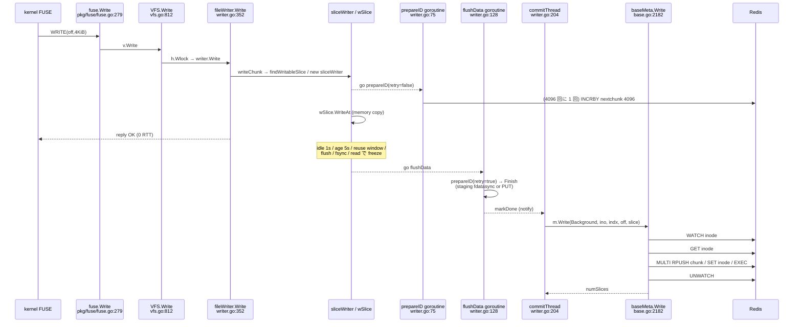

# A. write path と NewSlice の metadata RTT 調査

- 対象: `/home/kwatanabe/tmp_local/juicefs_inspection/juicefs` branch `1.4.1-improve-kaz`, HEAD `ea2c3757`（release-1.4.1-kaz.2 と同一 tree）。upstream 比較基点 `0b90c7db`（v1.4.1）。
- 方法: 読み取り専用のソース読解と grep のみ。ビルド・実行・計測はしていない。
- go-redis は `go.mod:73` の `github.com/redis/go-redis/v9 v9.18.0`。ローカル module cache（`~/go/1.25.11/pkg/mod/.../go-redis/v9@v9.18.0/tx.go`）で `Watch` の実装を確認した。
- 表記: **[事実]** はコードで確認したこと、**[推論]** はコードから導いた見積り、**[未確認]** は今回確認していないこと。

---

## 0. 結論サマリ

| 項目 | 結論 |
|---|---|
| FUSE write 応答が返る時点 | **[事実]** データは client メモリの `wSlice` ページへ copy 済み。slice ID・staging・upload・Meta.Write はどれも未完了でもよい。同期 metadata RTT は **0**。 |
| NewSlice | **[事実]** client 側で batch 予約済み（`sliceIdBatch = 4096`）。Redis では 4096 slice ごとに `INCRBY nextchunk 4096` を 1 回（1 RTT）。呼び出しは goroutine で非同期に行われ、FUSE write はブロックしない。 |
| 1 slice の commit（Redis） | **[事実→推論]** `WATCH` → `GET inode` → `MULTI/RPUSH/SET/EXEC`（pipeline） → `UNWATCH` の **4 RTT が直列**（hardlink 時は `HGETALL parent` で +1）。 |
| 4KiB random overwrite 1 回あたり | **[推論]** ほぼ 1 write = 1 slice となり、約 **4 RTT + 4/4096 RTT**。どれも後で非同期 commit され、FUSE write には乗らない。 |
| fsync / close / **read** | **[事実]** 未 commit slice をすべて freeze し、全 commit 完了まで待つ。待ち時間は N slice × 4 RTT が **inode 単位で直列**になる（後述の lock による）。同一 inode への VFS.Read も毎回この flush を行う。 |
| 主要 lock | handle `Wlock/Rlock`（handle 単位）、`fileWriter.Mutex`（inode 単位、writer 側）、meta `openFile` lock（inode 単位で Meta.Write 全体を保持）、redis `txlocks[fnv(inodeKey)%1024]`（client 全体で共有するストライプ）、`baseMeta.freeMu`（client global、NewSlice と inode 採番で共有）。 |
| slice ID の gap | **[事実]** 連続性・最大値に依存するコードは見当たらない。gc は object の mtime、dump/load は counter 値と max(id)+1 を使う。 |
| fragmentation | **[事実]** RPUSH の戻り値 = chunk の slice list 長。`%100==99` または `>350` で background compaction を要求し、`>=2500` では Meta.Write 内で **同期 compaction**（inode lock を保持したまま）。 |

---

## 1. write path の段階表

### 1.1 シーケンス



### 1.2 段階ごとの性質

| # | 段階（file:line, 関数） | metadata access | network RTT | 同期性・FUSE write への影響 | lock（スコープ） |
|---|---|---|---|---|---|
| 1 | `pkg/fuse/fuse.go:279` `fileSystem.Write` | なし | なし | 同期。`v.Write` の戻りで reply する | なし |
| 2 | `pkg/vfs/vfs.go:812` `VFS.Write` → `findHandle`、`h.Wlock`(:856)、`h.writer.Write`(:862)、`reader.Invalidate`、`invalidateAttr`(:1306, local map) | なし | なし | 同期 | `handle.Wlock`（handle 単位。同じ handle の reader・writer と排他、`pkg/vfs/handle.go:126`）、`v.modM`（global、短時間） |
| 3 | `writer.go:352` `fileWriter.Write`：背圧 `totalSlices()>=1000` なら 1ms sleep のループ(:353)。buffer 超過なら 10ms〜100ms sleep(:356-362)。`flushwaiting>0` の間は待つ(:369) | なし | なし（ただし flush 中は commit RTT を間接的に待つ） | 同期。背圧・flush 中は FUSE write が待たされる | `fileWriter.Mutex`（inode 単位。`dataWriter.files[inode]` で全 handle が共有、:608-627） |
| 4 | `writer.go:294` `writeChunk` → `findChunk`、`findWritableSlice`(:182)、新規なら `store.NewWriter(0)`、`go s.prepareID(..., false)`(:305)、chunk 最初の slice なら `go c.commitThread()`(:311) | なし（NewSlice は別 goroutine） | なし | 同期部分はメモリ操作のみ | fileWriter.Mutex を保持 |
| 5 | `writer.go:150` `sliceWriter.write` → `wSlice.WriteAt`(`pkg/chunk/cached_store.go:257`、page に copy)。`slen>=blockSize` かつ `id>0` なら `FlushTo`（block upload 開始、非同期 goroutine） | なし | なし（upload は goroutine） | 4KiB 単発では `slen < blockSize(4MiB)` のため upload は起きない | fileWriter.Mutex |
| — | **FUSE reply** | — | — | **ここで完了しているのは memory copy だけ** | — |
| 6 | `writer.go:75` `prepareID` → `Meta.NewSlice`（`base.go:2150`） | counter | 4096 回に 1 回 INCRBY（1 RTT） | 非同期 goroutine。呼び出し中は fileWriter.Mutex を外す(:80-82) | `baseMeta.freeMu`（client global、RTT 中も保持） |
| 7 | freeze のきっかけ：`flushAll`(:572、100ms 周期で age>`SliceFlushWait`=5s、idle>`SliceFlushIdle`=1s、total>800 なら半分)、`findWritableSlice` の reuse window(:190)、`commitThread` の age>2×wait(:213)、`flush()`(:431)、full slice(:162) | なし | なし | 非同期 | fileWriter.Mutex |
| 8 | `writer.go:128` `flushData` → `prepareID(retry=true)`（ID 未取得なら EIO の間 100ms ごとに再試行）→ `wSlice.Finish`(`cached_store.go:515`) → `upload`(:396)。writeback 時は `bcache.stage`（`disk_cache.go:853`、`stagingSync` 有効なら fdatasync）のあと、delayed staging に登録するか即時 PUT。writeback でなければ object PUT 完了まで待つ | なし（object key は slice ID から作る。`cached_store.go:75`） | object storage PUT（非 writeback 時）／local disk のみ（writeback 時） | 非同期 goroutine。完了で `markDone` | Finish 中は lock なし。markDone で fileWriter.Mutex |
| 9 | `writer.go:204` `commitThread`（**chunk ごとに 1 goroutine**）：`c.slices[0]` から作成順に `done` と `dep`（追記時のみ）を待ち、Meta.Write を呼ぶ(:227)。ctx は `meta.Background()` | **Meta.Write** | Redis 4 RTT（§2.3） | 非同期。ただし flush/fsync/read はこの完了を待つ | 待機中は fileWriter.Mutex。Meta.Write 中は外す(:221) |
| 10 | `base.go:2182` `baseMeta.Write`：`m.of.find(inode)` の `openFile.Lock()`(:2195-2197) → `en.doWrite` → `updateParentStat`/`updateUserGroupStat`（overwrite で delta=0 なら即 return、`quota.go:194,470`）→ compaction 判定(:2214) | inode attr・chunk list・usedSpace | 4 RTT＋（≥2500 slices なら同期 compaction） | commitThread 上で同期 | **meta openFile lock（inode 単位、doWrite の RTT 全体を保持）** |
| 11 | `redis.go:1144` `redisMeta.txn`：`txLock(fnv(inodeKey))`(:1162) → `rdb.Watch` | — | §2.3 | 同期 | **`baseMeta.txlocks[h%1024]`**（client 全体で共有する 1024 ストライプ。同じ inode は必ず同じストライプ） |
| 12 | `vfs.go:1051` `VFS.Fsync` / `vfs.go:1005` `VFS.Flush` → `fileWriter.flush`(`writer.go:409`)：全 slice を freeze し、`len(f.chunks)==0` まで 3s 周期で待つ。`flushwaiting++` の間は同じ inode への新規 Write を止める | 間接的（commit 待ち） | pending slice 数 × 4 RTT（直列、§4） | 同期で FUSE fsync/flush 応答をブロック | handle Wlock、fileWriter.Mutex（cond wait） |
| 13 | **`vfs.go:791-799` `VFS.Read`**：`h.Rlock` を取ったあと `v.writer.Flush(ino)` を呼ぶ | 間接的（commit 待ち）、その後 `Meta.Read`（chunk cache は Write ごとに invalidate、`base.go:2201`） | 12 と同じ＋読み込み時の LRANGE | 同期で FUSE read をブロック。Rlock 中なので同じ handle の Write も止まる | handle Rlock |

**[事実]** fork の差分では writer 側の metadata 呼び出し列は変わっていない。`writer-reuse-window`（default 4。upstream の `i > 3` と同じ挙動）、`slice-flush-wait`/`slice-flush-idle`（default 5s/1s。upstream の固定値と同じ）、`writer-flush-timeout`（default 0 は deadline なし）、trace ログ、FUSE watchdog の無効化（`fuse.go` の `opt.Timeout = 0`）、Read の flush エラーを返す変更、が主な違い（`git diff 0b90c7db HEAD -- pkg/vfs pkg/fuse`）。

**[事実]** VFS.Read が書き込み中の inode を flush するのは upstream でも同じ（upstream では `_ = v.writer.Flush(ctx, ino)` で、エラーを無視していた）。

---

## 2. NewSlice（slice ID 採番）

### 2.1 interface と共通実装

- **[事実]** `pkg/meta/interface.go:473-474` `NewSlice(ctx Context, id *uint64) syscall.Errno`
- **[事実]** 実装は baseMeta の 1 つだけ（engine 別の override はない）。`pkg/meta/base.go:2150-2164`

```go
m.freeMu.Lock(); defer m.freeMu.Unlock()
if m.freeSlices.next >= m.freeSlices.maxid {
    v, err := m.en.incrCounter("nextChunk", sliceIdBatch)
    ...
    m.freeSlices.next = uint64(v) - sliceIdBatch
    m.freeSlices.maxid = uint64(v)
}
*id = m.freeSlices.next; m.freeSlices.next++
```

- **[事実]** 予約サイズは `sliceIdBatch = 4 << 10 = 4096`（`base.go:51`）。range は `freeID{next, maxid}`（`utils.go:84`）。
- **[事実]** lock は `baseMeta.freeMu`（`base.go:322`）。client process 全体で 1 つの mutex で、**inode 採番（`base.go:1526`）と共用**。refill の RTT 中も保持し続ける。
- **[事実]** 枯渇時は lock を持ったまま同期で `incrCounter` を呼ぶ。inode 側にある prefetch（`prefetchedInodes`）に相当する仕組みは slice には**ない**。
- **[事実]** 失敗時は errno を返し、range は更新しない。writer 側では `prepareID(retry=true)` が EIO の間 100ms ごとに再試行する（`writer.go:83-96`）。EIO 以外のエラーは `s.err` に入り、その slice は Abort される。

### 2.2 engine 別の incrCounter

| engine | 実装 | 1 refill あたりの RTT |
|---|---|---|
| Redis | `redis.go:484-509`：ChangeLog 無効なら `INCRBY <prefix>nextchunk 4096` を 1 回。戻り値に +1 する（Redis の counter は sql/tkv より 1 小さい、:504-507） | **1 RTT**。ChangeLog 有効なら `TxPipelined` の中で `m.rdb.IncrBy` を（pipe ではなく）直接呼ぶので、INCRBY 1 回＋MULTI/EXEC 1 回で**約 2 RTT**（[推論]） |
| SQL | `sql.go:963-990`：txn 内で `SELECT ... FOR UPDATE` → `UPDATE`（無ければ INSERT） | [推論] BEGIN/SELECT/UPDATE/COMMIT で 3〜4 RTT |
| TKV | `tkv.go:1150-1159`：txn 内の `incrBy` | [推論] get＋commit で engine 依存、2 RTT 以上 |

- **[推論]** Redis の場合、1 slice あたりの NewSlice の RTT は **1/4096 ≈ 0.00024**。実質無視できる。
- **[事実]** 呼ばれるタイミングは次の 2 か所。
  1. slice 作成時（`writer.go:305`）の `go s.prepareID(meta.Background(), false)`。**非同期で、FUSE write をブロックしない**。
  2. freeze 後の `flushData`（`writer.go:133`）。ここで ID がまだ無ければ retry 付きで取得する。staging/upload の object key は ID から作るので（`cached_store.go:75` `chunks/%d/%d/%d_%d_%d`）、**ID が確定するまで block は upload/stage できない**。ID 未確定の間は `write()` の `FlushTo` もスキップする（`writer.go:164`）。
- **[事実]** compaction も新しい slice ID を `NewSlice` で取る（`base.go:2918`）。

---

## 3. slice ID の一意性と gap を許容できる根拠

| 観点 | 根拠（file:line） | 判定 |
|---|---|---|
| multi-client の一意性 | Redis の `INCRBY` は原子的（`redis.go:493`）、SQL は `FOR UPDATE` の txn（`sql.go:976`）、TKV は txn（`tkv.go:1153`）。client はそれぞれ互いに重ならない [v-4096, v) を取る | **[事実]** 一意 |
| crash 時の未使用 ID | 予約した range の残りは捨てられ、counter は戻さない。再利用する仕組みもない | **[事実]** gap が出るだけ |
| object key | `rSlice.key`（`cached_store.go:75-80`）は id/1e6, id/1e3 のディレクトリと `id_indx_bsize`。連続性は要らない | **[事実]** gap があってよい |
| gc | `cmd/gc.go:112,307`：`maxMtime = now-1h`（指定可）より新しい object は無視。`ListSlices` の結果と照合（:240-253、:325-332）。ID の大小や counter とは比べていない | **[事実]** ID 順に依存しない |
| sliceRef | Redis では `sliceRefs` hash（`redis.go:800`）を 2 回目以降の参照（clone/copy）でだけ作る（`doWrite` のコメント「1 == not exists」、`redis.go:3172-3173`）。削除は `HDel`（:318-324） | **[事実]** ID の連続性に依存しない |
| dump/load | dump は counter をそのまま出力（Redis は +1 して sql と揃える、`redis.go:5010-5011`）。load は counter を戻す（`redis.go:5226`、`sql.go:5270`、`tkv.go:4371`）。さらに読み込んだ slice の `max(id)+1` まで引き上げる（`dump.go:571-572`） | **[事実]** gap は保たれ、巻き戻らない |
| fsck | `cmd/fsck.go:115` は `ListSlices` を使った存在確認だけ | **[事実]**（grep の範囲で）counter に依存しない |
| 他に nextChunk を参照する場所 | grep の結果、上記以外にない（`pkg/vfs/fill.go` の `nextChunkIndex` は無関係） | **[事実]** |

**[推論]** 予約 batch を大きくしたり prefetch を足したりしても、ID 空間を早く消費する以外の正しさへの影響は、上の範囲では見当たらない。

---

## 4. VFS／meta の lock と commit 順序

- **[事実]** handle lock（`handle.go:102-149`）：`Wlock` は readers=0 かつ writing=0 を待つ（writer 1 つ）。`Rlock` は writing/writers=0 を待つ。**QEMU が 1 つの fd で読み書きする場合、FUSE の Read と Write は同じ handle 上で排他になる**（[推論] fh が同じ場合）。
- **[事実]** fileWriter（`writer.go:257`）は `dataWriter.files[inode]` で **inode ごとに 1 つ**あり、全 handle で共有する。Write・flush・commitThread の待機はすべてこの mutex を使う。
- **[事実]** commitThread は **chunk ごとに goroutine 1 つ**（`writer.go:307-311`）。同じ chunk の中では作成順に直列で commit する（:209-252）。
- **[事実]** 同じ inode の別 chunk にある commitThread は goroutine としては並列に動く。しかし Meta.Write の中で
  1. `openFile.Lock()`（`base.go:2195-2197`、inode 単位、doWrite 全体を保持）
  2. redis `txLock(fnv(inodeKey) % 1024)`（`redis.go:1162`、`base.go:665`）
  
  の 2 つを取るので、**同じ inode の commit は client 内で完全に直列**になる（[事実] lock のスコープ、[推論] 実効的に直列化される）。
- **[事実]** `openFile` は `baseMeta.Open` で必ず登録される（`base.go:2091`、OpenCache が 0 でも登録される）。そのため VM image を open 中は常にこの lock がかかる。
- **[事実]** `txlocks` は client 全体で 1024 本のストライプなので、別の inode でも hash が衝突すれば直列になる。
- **[推論]** 1 inode の metadata commit の上限は 1/(4 RTT) slice/s。例: RTT 1ms で約 250 slice/s（4KiB random なら約 1MB/s）。RTT 5ms で約 50 slice/s。
- fork の設定が効くところ（[事実]）：
  - `WriterReuseWindow`（`writer.go:190`）：末尾から window 以上離れた未 freeze の slice を freeze する。random write では reuse 自体がほとんど起きない。
  - `SliceFlushWait/Idle`（`writer.go:586-587`）：freeze を遅らせると commit をまとめる効果はあるが、**slice 数は減らない**（重なりや離れた位置への write は別 slice になる）。
  - `WriterFlushTimeout=0`（:417-420）：fsync は失敗せず、完了まで待ち続ける。

---

## 5. 4KiB random overwrite 1 回の metadata API 列（Redis）

前提: 既存領域を上書きし、ファイル長は変わらない。quota・dirstats は有効でも delta=0。hardlink ではない（attr.Parent>0）。ChangeLog は無効。

| 順 | API | backend コマンド | RTT | タイミング |
|---|---|---|---|---|
| 1 | NewSlice | 4096 回に 1 回 `INCRBY nextchunk 4096` | 1/4096 | 非同期（slice 作成直後） |
| 2 | （data） | staging 書き込み（writeback、stagingSync で fdatasync）または PUT | metadata RTT なし | freeze 後 |
| 3 | Meta.Write → doWrite | `WATCH inode` | 1 | commit |
| 4 | 〃 | `GET inode`（`redis.go:3145`） | 1 | 〃 |
| 5 | 〃 | `getParents`：parent>0 なら RTT なし（`redis.go:3338`）。hardlink なら `HGETALL` | 0（+1） | 〃（checkQuota の引数として必ず評価される） |
| 6 | 〃 | `MULTI; RPUSH chunk; SET inode; [INCRBY usedSpace]; EXEC`（`redis.go:3169-3179`） | 1 | 〃 |
| 7 | 〃 | `UNWATCH`（go-redis `Tx.Close`、`tx.go:71-73`） | 1 | 〃 |
| 8 | updateParentStat / updateUserGroupStat | delta=0 なので何もしない | 0 | 〃 |
| 9 | compaction 判定 | §6 | 0（background）／≥2500 では同期 | 〃 |

- **[推論]** 合計は **約 4.0002 RTT / write**。WATCH が競合して失敗すると txn 全体を再試行するが（`redis.go:1184-1203`）、client 内の直列化があるので、他 client や compaction と競合しない限り稀。
- **[推論]** fsync が来た場合: その時点で pending な slice が N 個あれば、追加の待ちは **N × 4 RTT（直列）＋ data の stage/PUT 時間**。fsync 自体の metadata API は増えない（`VFS.Fsync` は writer.Flush だけ、`vfs.go:1051-1073`）。直前に flush 済みで pending が 0 なら即 return する。
- **[推論]** close の FLUSH も同じで、POSIX lock を持っていれば `Setlk(F_UNLCK)` が +α 加わる（`vfs.go:1043-1045`）。
- **[推論]** read が混ざる場合: 同じ inode の read 1 回ごとに上の flush が走る（`vfs.go:799`）。さらに Write ごとに chunk cache が invalidate される（`base.go:2201`）ので、`Meta.Read` で `LRANGE` が +1 RTT 以上かかる。
- **[未確認]** kernel 側が write に伴って GETATTR/SETATTR（suid 剥奪など）を出すか、QEMU の cache mode（O_DIRECT か）による違い。

### 5.1 write 1 回 = slice 1 個になるか

- **[事実]** `findWritableSlice`（`writer.go:182-201`）が既存 slice に追記させるのは、`pos` がその slice の未 flush 末尾範囲 `[off+flushoff, off+slen]` に入るとき**だけ**。範囲外で、かつ既存 slice と重なる場合は `nil` を返して新しい slice を作る。
- **[推論]** random 4KiB では、隣接して続くとき以外は 1 write ごとに新 slice になり、Meta.Write も 1 回ずつ増える。同じ 4KiB を繰り返し上書きしても、未 freeze の末尾 slice の範囲内であれば同じ slice に入る（slen は増えない）。

---

## 6. slice fragmentation と compaction の閾値

| 定数・条件 | 場所 | 意味 |
|---|---|---|
| `numSlices = RPUSH の戻り値` | `redis.go:3180-3181` | 上書きで隠れた slice も含む chunk list 全体の長さ（TKV は `len(val)/sliceBytes`、`tkv.go`。SQL は commit 後に再 Get） |
| `numSlices%100 == 99 \|\| numSlices > 350` | `base.go:2214` | background compaction を要求（`requestBackgroundCompaction`）。350 を超えると**毎 commit で要求**する |
| `maxSlices = 2500` | `base.go:64`, `:2215-2221` | これ以上なら `compactChunk(once=true)` を **Meta.Write 内で同期実行**する。このとき openFile lock（inode）を保持したままなので、その inode の他の commit はすべて止まる。同じ chunk を compaction 中なら 10ms sleep のループで待つ（`base.go:2853-2862`） |
| `maxCompactSlices = 1000`（etcd は 100） | `base.go:63`, `:2897-2898`, `tkv_etcd.go:344` | 1 回の compaction で先頭 1000 slice まで処理する |
| `skipSome` | `slice.go:183` | 先頭にある 1MiB 以上・合計の 20% 超の大きな slice は compaction 対象から外す |
| Read 側の要求 | `base.go:2138-2143` | 読み込み時に slice が 5 以上なら要求（fork で `go compactChunk` から scheduler 経由に変更） |
| legacy scheduler | `compaction_scheduler_lifecycle.go:45` | `go m.compactChunk(...)`。`m.compacting[k]` が立っていれば即 return（dedupe） |
| priority scheduler（fork） | `compaction_scheduler_lifecycle.go:8-16`, `compaction_scheduler.go:79-87` | `--compaction-scheduler=priority` で有効。worker 11、pending capacity 1024（超えたら hint を捨てる）。bucket は count>=1000→2、>=100→1、それ以外→0。inode ごとの round robin |
| writer 側の背圧 | `writer.go:353`, `:579` | 1 file あたり pending slice が 800 を超えると半分を freeze、1000 以上なら Write を 1ms sleep で待たせる |

- **[推論]** random 4KiB の write が 1 chunk（64MiB）に集中すると、commit 1 回で list が 1 ずつ伸びる。99, 199, ... の時点で compaction を要求し、350 を超えると毎回要求する。compaction が追いつかずに 2500 に達すると、その inode の commit が同期 compaction（object の read と再 PUT を含む）で止まる。
- **[推論]** compaction は 1 回ごとに `doRead`(LRANGE) + NewSlice(amortized) + 必要なら GetAttr + object の read/write + `doCompactChunk` txn + 旧 slice の削除という metadata/object 負荷を生む。合成後の slice は slice 群の span（最大 64MiB）になり、write amplification が大きい。
- **[未確認]** 実運用での slice 数の推移、compaction の完了速度、2500 到達の有無（ログ `slow metadata write ... compact=` で確認できる）。

---

## 7. 観測事実・推論・未確認の整理

### 観測事実（コードで確認）
1. FUSE write の同期区間に metadata/network の呼び出しはない（`fuse.go:279` → `vfs.go:812-871` → `writer.go:352-396`）。
2. NewSlice は 4096 個単位で client 側に予約する。Redis では 1 refill = INCRBY 1 回。lock は `freeMu`（global、inode 採番と共用、RTT 中も保持）。prefetch はない。
3. NewSlice は slice 作成時に非同期 goroutine で呼ばれる。ID が確定するまで stage/upload はできない。
4. Redis の doWrite は WATCH・GET・MULTI..EXEC・UNWATCH の 4 往復。
5. Meta.Write は inode 単位の openFile lock と inode key の txlock を RTT の間ずっと保持する。
6. flush/fsync/read は inode の全 pending slice の commit を待つ。read も同じ。
7. maxSlices=2500 で同期 compaction が起き、inode lock を保持したままになる。
8. slice ID の連続性に依存するコードは gc/fsck/dump/load/sliceRef に見当たらない。

### 推論
- 4KiB random overwrite 1 回 ≈ 4 RTT（非同期 commit）。fsync の待ちは pending slice 数 × 4 RTT が inode 単位で直列になる。
- NewSlice の batch はすでに効いているので、RTT 削減の主な対象は **doWrite の 4 RTT**（WATCH/UNWATCH の削減、Lua script 化、複数 slice の pipeline/batch commit）と、**inode 単位の commit 直列化**、**read 時の flush** だと考えられる。
- ChangeLog 有効時の Redis incrCounter は、IncrBy が pipe の外で実行される実装になっている（設計上の不整合の可能性。`redis.go:495`）。

### 未確認
- 実環境の Redis RTT、kernel から来る FUSE 要求の内訳（GETATTR 等）、QEMU の I/O mode、hardlink の有無、ChangeLog の設定。
- SQL/TKV の doWrite の正確な RTT 数（SQL は `sliceRef` を毎回 INSERT し、TKV は chunk 値全体を毎回 rewrite するので、fragmentation が進むと O(n) で重くなる。`sql.go:3355-3400`、`tkv.go` の doWrite）。
- go-redis の接続 pool の待ちや retry 設定による追加 RTT。
